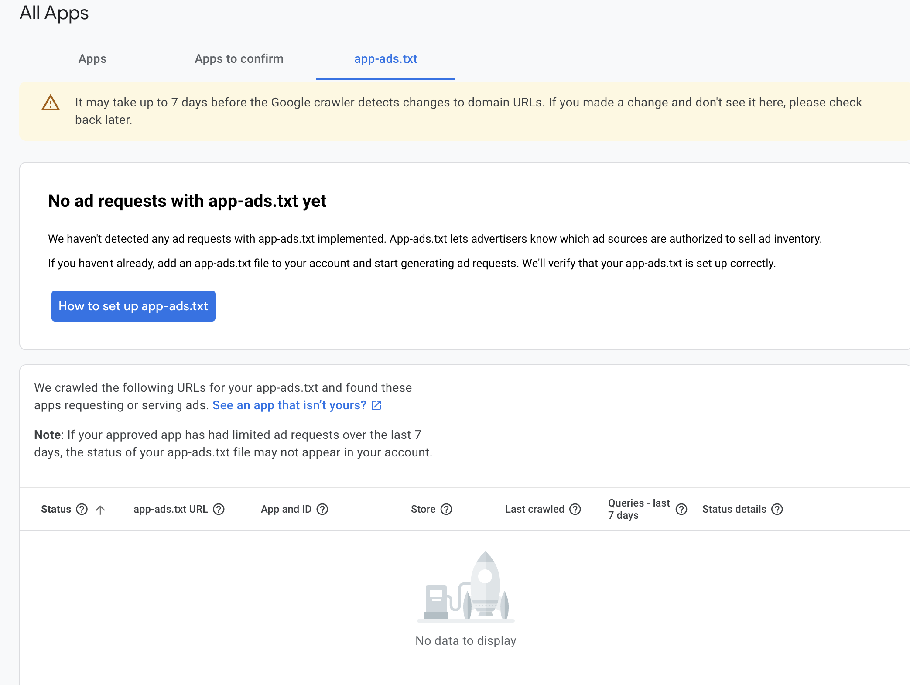

# Admob 需要设置app-ads.txt文件



## 如何为你的app设置app-ads.txt 

 - 如果你还没有这个文件，使用IAB Tech Lab提供的规范创建app-ads.txt文件。
 - 复制并粘贴以下代码片段到app-ads.txt文件中(这个只是个例子，需要使用自己对应项目提供的值)：
```
google.com, pub-7631367854727140， DIRECT, f08c47fec0942fa0
```
 - 将app-ads.txt发布到开发者网站的根目录（例如sampledomain.com/app-ads.txt）。请确保输入的域名与b谷歌Play或App Store上列出的完全一致。
 - 等待至少24小时，让AdMob抓取并验证你的app-ads.txt文件。
 - 回到AdMob，检查app-ads.txt状态。


## 使用firebase部署app-ads.txt

app-ads.txt可以部署在firebase的self-hosting中，详见 [[self-hosting]]