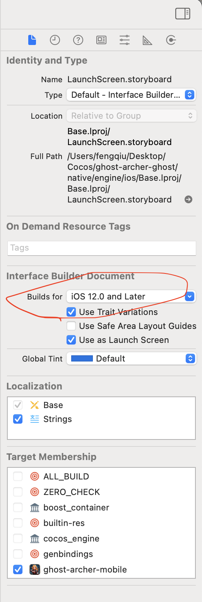

# Cocos Creator 构建iOS

## 构建资源

## 多语言
cocos creator游戏中的多语言适配是使用i18n或L10N管理实现的，无需在xcode中额外配置支持，但对于一些系统权限弹窗，启动页，应用标题等，需要在xcode中做多语言适配

## 内存管理
cocos creator 默认编译的是手动管理内存模式，对于自定义的oc文件需要在MakeList文件中指明内存管理策略，或在xcode工程中手动指明使用arc模式

## 编译问题

1. 可能会经常遇到问题:
```
Failed to find or create execution context for description <IBCocoaTouchPlatformToolDescription: 0x7fa8bad9a6f0>
```
解决方案：
- 去掉Apple Vision的支持
- LaunchScreen.xib `Interface Build Document`支持版本设置高一点


2. 和Swift混编问题
Swift文件也需要在MakeList.txt中指明，并且指明swift编译相关的配置，例如:
```
cmake_minimum_required(VERSION 3.8)

set(CMAKE_SYSTEM_NAME iOS)
set(APP_NAME "射手传奇" CACHE STRING "Project Name")

project(${APP_NAME} CXX)

# Project directories
set(CC_PROJECT_DIR ${CMAKE_CURRENT_LIST_DIR})
set(CC_UI_RESOURCES)
set(CC_PROJ_SOURCES)
set(CC_ASSET_FILES)
set(CC_COMMON_SOURCES)
set(CC_ALL_SOURCES)

# Include common CMakeLists
include(${CC_PROJECT_DIR}/../common/CMakeLists.txt)

# Add your Objective-C files here (including Swift support files)
list(APPEND CC_PROJ_SOURCES
    ${CMAKE_CURRENT_LIST_DIR}/GameJSBridge.h
    ${CMAKE_CURRENT_LIST_DIR}/GameJSBridge.m
    ${CMAKE_CURRENT_LIST_DIR}/JSAPIHandler.h
    ${CMAKE_CURRENT_LIST_DIR}/JSAPIHandler.m
    ${CMAKE_CURRENT_LIST_DIR}/IAPManager.swift
    ${CMAKE_CURRENT_LIST_DIR}/AdManager.swift
    ${CMAKE_CURRENT_LIST_DIR}/GoogleMobileAdsConsentManager.swift
    ${CMAKE_CURRENT_LIST_DIR}/Utils.swift
    ${CMAKE_CURRENT_LIST_DIR}/GameCenterManager.swift
)

# Add the Bridging Header for Swift-Objective-C interoperability
list(APPEND CC_PROJ_SOURCES
    ${CMAKE_CURRENT_LIST_DIR}/ghost-archer-mobile-Bridging-Header.h
)


# Enable ARC by adding the -fobjc-arc flag to Objective-C files
set_source_files_properties(
    ${CMAKE_CURRENT_LIST_DIR}/GameJSBridge.m
    ${CMAKE_CURRENT_LIST_DIR}/JSAPIHandler.m
    PROPERTIES COMPILE_FLAGS "-fobjc-arc"
)

# Add Objective-C and Swift files to all sources
list(APPEND CC_ALL_SOURCES ${CC_PROJ_SOURCES} ${SWIFT_SOURCES})

# Set Swift flags and libraries (for Swift compilation)
set(SWIFT_FLAGS "-fobjc-arc")

# Frameworks needed for Swift
set(SWIFT_LIBRARIES
    "-framework Foundation"
    "-framework UIKit"
    "-framework CoreGraphics"
    "-framework StoreKit"
)

# Link the libraries for Swift
link_libraries(${SWIFT_LIBRARIES})

# Set the executable name
set(EXECUTABLE_NAME ${APP_NAME})

# Use Cocos Creator macros for iOS build (if needed)
cc_ios_before_target(${EXECUTABLE_NAME})

# Define the executable with CMake
add_executable(${EXECUTABLE_NAME} ${CC_ALL_SOURCES})

# After target setup for iOS
cc_ios_after_target(${EXECUTABLE_NAME})

# Ensure that CMake compiles Swift files correctly (you might need to use the Xcode generator)
set_target_properties(${EXECUTABLE_NAME} PROPERTIES
    SWIFT_VERSION "5.0"
    SWIFT_OBJC_BRIDGING_HEADER "${CMAKE_CURRENT_LIST_DIR}/Features/ghost-archer-mobile-Bridging-Header.h"
)

```

可能cocos creator编译后swift的文件并未添加到主工程中，此时需要手动创建一个swift文件，并自动创建bridge-header文件，删掉该swift文件后，把源swift文件勾选到目标target中，并在bridge-header文件中指明会被swift引用到oc头文件。