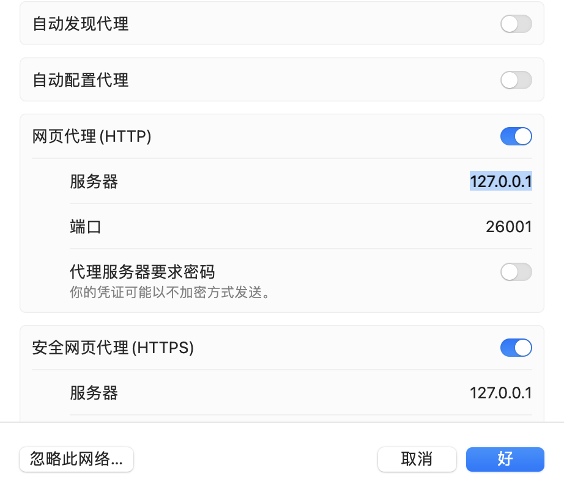

#  Firebase Hosting

### 1. Firebase Hosting是什么?
 - Firebase Hosting 可为您的 Web 应用提供快速、安全的托管服务。

- Firebase Hosting 是面向开发者的生产级 Web 内容托管服务。您只需运行一个命令，便可轻松快捷地将 Web 应用部署到全球级 CDN（内容分发网络）中。虽然 Firebase Hosting 针对静态和单页 Web 应用进行了优化，不过，您还可以将 Firebase Hosting 与 Cloud Functions 或 Cloud Run 搭配使用，在 Firebase 上构建和托管动态内容和微服务。


### 2. 主要功能
|  |  |
| :------------ | :-----|
| 通过安全连接提供内容 |  Firebase Hosting 中内置了零配置的 SSL，因此始终能够确保安全地分发内容。 |
| 快速提供内容      | 您上传的每个文件均缓存在遍布世界各地的 CDN 边缘服务器的 SSD 上，并以 gzip 或 Brotli 的形式传送。我们会为您的内容自动选择最佳的压缩方法。无论您的用户身处何处，内容都可快速加载。 |
| 在上线前模拟甚至共享所做的更改     | 通过本地托管的网址查看和测试更改，并与模拟后端进行交互。 |
| 使用临时预览网址与团队成员共享更改。 | Hosting 还提供 GitHub 集成，以便轻松迭代预览的内容。 |
|使用一个命令部署新版本	| 利用 Firebase CLI，您可以在短短几秒钟内启动并运行您的应用。利用命令行工具，您可以将部署目标添加到构建流程中。如果您需要撤消部署，Hosting 可提供一键式回滚。
	
	
### 3. 工作原理

无论您是在部署一个简单的应用着陆页，还是部署复杂的渐进式 Web 应用 (PWA)，Hosting 均为您提供了专为部署和管理网站和应用而特别开发的基础架构、功能和工具。

使用 Firebase CLI，您可以从计算机上的本地目录将文件部署到我们的 Hosting 服务器。除了提供静态内容之外，您还可以使用 Cloud Functions for Firebase 或 Cloud Run 在您的网站上提供动态内容和托管微服务。所有内容都可从我们的全球级 CDN 上最近的边缘服务器通过 SSL 连接提供。

您还可以在上线前查看和测试更改。 使用 Firebase Local Emulator Suite，您可以通过本地托管的网址模拟您的应用和后端资源。您还可以使用临时预览网址共享更改，并设置 GitHub 集成，以便在开发期间轻松迭代。

Firebase Hosting 具有轻量级托管配置选项，支持您构建精密的 PWA。您可以轻松为客户端路由重新编写网址、设置自定义标头，甚至可以提供本地化的内容。

为了分发您的内容，Firebase 提供了多个网域和子网域选项：

默认情况下，每个 Firebase 项目在 web.app 和 firebaseapp.com 网域上都有免费的子网域。这两个网站提供相同的已部署内容和配置。

如果您拥有提供不同内容但仍共享相同 Firebase 项目资源的相关网站和应用（例如，如果您有博客、管理面板和公开应用），则可以创建多个网站。

您可以将自己的域名关联到 Firebase 托管的网站。

Firebase 会自动为您的所有网域预配 SSL 证书，确保安全提供您的所有内容。


### 4. 实现流程

 * 安装 Firebase CLI	
    * 有了 Firebase CLI，您可以轻松设置新 Hosting 项目、运行本地开发服务器以及部署内容。
* 设置项目目录	
  * 将静态资源添加到本地项目目录，然后运行 firebase init 将该目录与 Firebase 项目关联。

  * 在本地项目目录中，您还可以为动态内容和微服务设置 Cloud Functions 或 Cloud Run。

* 在上线之前查看、测试并共享更改（可选）	
  * 运行 firebase emulators:start 以通过本地托管的网址模拟 Hosting 和后端项目资源。

  * 如需通过临时预览网址查看并共享更改，请运行 firebase hosting:channel:deploy 以创建预览渠道并向其实施部署。设置 GitHub 集成，以便轻松迭代预览的内容。

* 部署您的网站	
  * 当一切就绪时，运行 firebase deploy 即可将最新的快照上传到我们的服务器。如果您需要撤消部署，只需在 Firebase 控制台中执行一键式回滚。

* 关联到 Firebase Web 应用（可选）	
  * 通过将您的网站关联到 Firebase Web 应用，您可以使用 Google Analytics 收集应用的使用情况和行为数据，还可以使用 Firebase Performance Monitoring 深入了解应用的性能特征。


### 5. 使用入门

#### 准备工作

您必须先创建一个 Firebase 项目，然后才能设置 Firebase Hosting。

##### 第 1 步：安装 Firebase CLI
参阅 Firebase CLI 文档，了解如何安装 CLI 或将其更新为最新版本。

##### 第 2 步：初始化您的项目

如需将本地项目文件与 Firebase 项目关联，请从本地项目目录的根目录下运行以下命令：

```
    firebase init hosting
```

 **在项目初始化期间，请按照 Firebase CLI 提示执行以下操作：**

 - 选择一个 Firebase 项目以与您的本地项目目录关联。

   - 选定的 Firebase 项目是本地项目目录的“默认”Firebase 项目。要将其他 Firebase 项目关联到本地项目目录，请设置项目别名。

 - 指定用作公共根目录的目录。

   此目录包含您公开提供的所有静态文件，包括 index.html 文件以及要部署到 Firebase Hosting 的所有其他资产。

   - 公共根目录的默认名称为 public。

     - 您可以立即指定公共根目录，也可以稍后指定（在您的 firebase.json 配置文件中）。

     - 如果您选择默认值并且还没有名为 public 的目录，Firebase 会为您创建该目录。

    - 如果您的公共根目录中不存在有效的 index.html 文件或 404.html 文件，Firebase 会为您创建一个。

- 为您的网站选择配置。

  如果您选择制作一个单页应用，Firebase 会自动为您添加重写配置。

  在初始化结束时，Firebase 会自动创建两个文件，并将其添加到本地应用目录的根目录下：

  - firebase.json 配置文件，其中列出了您的项目配置。如需详细了解此文件，请参阅配置托管行为页面。

  - .firebaserc 文件，其中存储有项目别名。

##### 第 3 步：部署到您的网站  

要部署到您的网站，请从本地项目目录的根目录下运行以下命令：
```
    firebase deploy --only hosting
```

`注意：如果运行带有 --only hosting 标志的此命令，您部署的只是您的 Hosting 内容和配置。如果您还希望部署其他项目资源或配置（例如函数或数据库规则），请运行此命令，并在标志中使用逗号分隔列表（例如 --only hosting,functions）。`

此命令会将您的 Hosting 内容和配置部署到以下 Firebase 预配的子网域：

PROJECT_ID.web.app
PROJECT_ID.firebaseapp.com
详细了解如何[部署并在本地测试您的网站](https://firebase.google.com/docs/hosting/test-preview-deploy?hl=zh-cn)。


### 6. 其他

常见命令:
 - firebase login
 - firebase logout
 - firebase deploy --only hosting 

注意事项:
如果登陆过期需要重新登陆:
```
firebase login --reauth
``` 
但上述命令通常会遇到问题错误如: 
```
Authentication Error: Your credentials are no longer valid. Please run firebase login --reauth

For CI servers and headless environments, generate a new token with firebase login:ci

Error: An unexpected error has occurred.
```
 此时可使用如下命令:
```
firebase login --reauth --no-localhost
```
但这时可能仍会遇到该问题，此时需要查看网络的代理，并且设置代理服务器之后即可:
```
export http_proxy=http://127.0.0.1:26001
export https_proxy=http://127.0.0.1:26001
```


### 7. 应用

可以用于部署Admob 的app-ads.txt文件, 具体见[[appAds]]