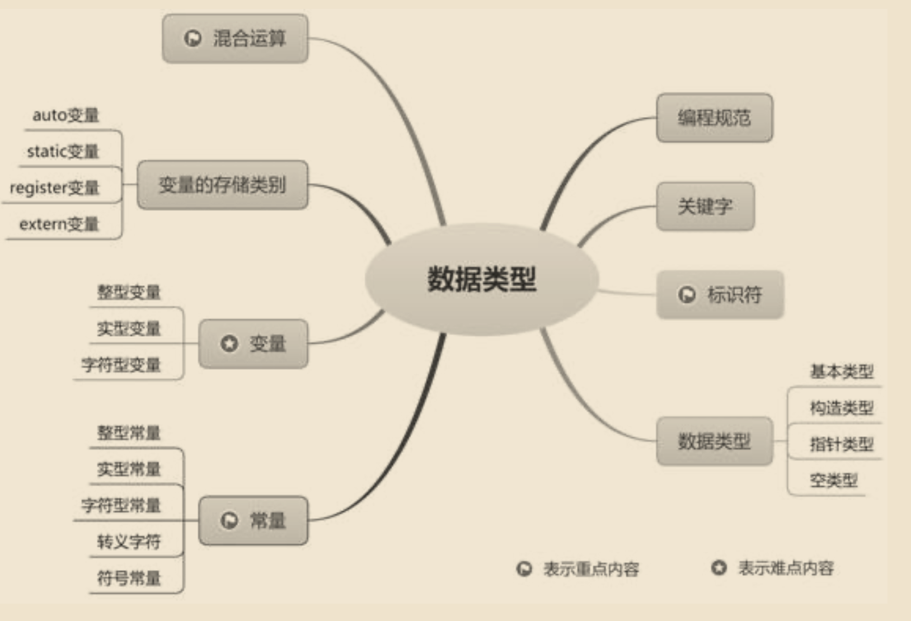
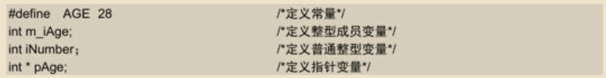
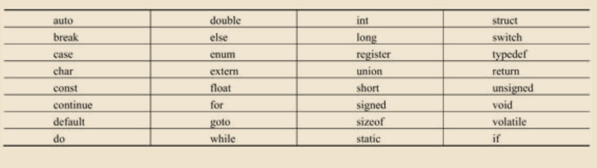
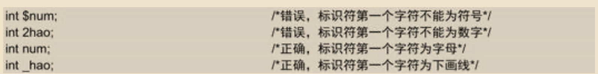
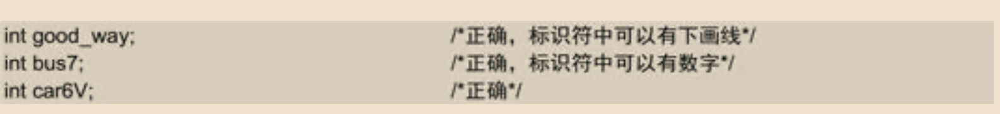
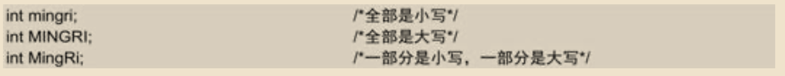
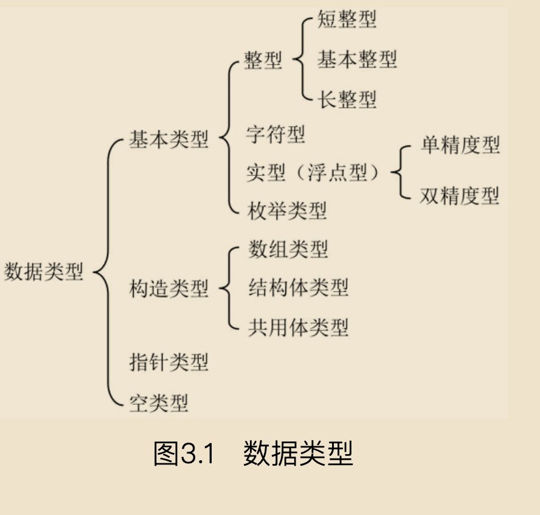

# 基础



## 编程规范

### 1．代码缩进

C语言中，代码按递进层次依次向右缩进，每次缩进4个字符。不采用空格，而采用Tab键制表位，以保证缩进的对齐。

### 2．变量、常量命名规范

- 常量命名统一为大写格式。
- 如果是成员变量，均以m_开始。
- 如果是普通变量，取与实际意义相关的名称，并且名称的首字母要大写，再在前面添加类型的首字母。
- 如果是指针，则在其标识符前添加p字符，并且名称首字母要大写

例如：


3．函数的命名规范 

定义函数时，函数名的首字母要大写，其后的字母根据含义大小写混合。例如：
```
int AddTwoNum(int num1,int num2);
```

4．注释

尽量采用行注释。如果行注释与代码处于一行，则注释应位于代码右方。如果连续出现多个行注释，并且代码较短，则应对齐注释。

```
int iLong;              /*长度*/

int Width;              /*宽度*/

int Height              /*高度*/

```

## 关键字


关键字（Keywords），又称为保留字，是C语言规定的具有特定意义的字符串。C语言中有32个关键字，如表3.1所示。用户定义的常量、变量、函数等名称不能与关键字相同，否则会出现错误。



## 标识符

C语言中，为了在程序的运行过程中可以使用变量、常量、函数、数组等，就要为这些形式设定一个名称，而设定的名称就是所谓的标识符。 
标识符的名称设定比较自由，开发者可以设定自己喜欢且容易理解的各类名称。但这并不意味着可以随意自由发挥，下面介绍设定C语言标识符时应该遵守的一些基本命名规则。

（1）标识符必须以字母或下画线开头，而不能以数字或者符号开头。例如：


（2）标识符中，除开头外的其他字符可以由字母、下画线或数字组成。例如：


（3）C语言区分大小写，也就是说，大写或小写的英文字母代表的是不同的标识符。例如，下面的代码给出了3个不同的标识符


（4）标识符不能是关键字。例如，系统使用int关键字表示整型数据类型，因此用户定义的标识符就不能再使用int，否则会提示编译错误。但将其中的某个字母改写成大写字母后，就可以通过编译。

（5）标识符应体现一定的功能含义，便于理解。通常采用所表述内容的英文、拼音等，这样即便是没有注释，只直观地查看代码，也能快速了解到其表述的作用及功能。

（6）ANSI标准规定，标识符可以为任意长度，但外部名必须保证仅前6个字符就能唯一地进行区分。这是因为某些编译程序（如IBM PC的MS C）仅能识别前6个字符。


## 数据类型

C语言中的数据类型包括基本类型、构造类型、指针类型和空类型等，如图3.1所示。



#### 1．基本类型

基本类型是C语言中的基础类型，包括**整型、字符型、实型（浮点型）、枚举类型**4类。

#### 2．构造类型

当基本类型不能满足需要时，开发者可以自行构造数据类型。即使用基本类型数据，或已构造好的数据类型，通过添加、设计、组合，形成能满足待解决问题需要的新的数据类型。

构造类型是由多种类型组合而成的新类型，其每个组成部分都称为成员。构造类型包括**数组类型、结构体类型和共用体类型3类**。

#### 3．指针类型

指针是C语言的精华。指针类型不同于其他类型，因为其值表示的是某个内存地址。

#### 4．空类型 

空类型的关键字是void，主要用于对函数返回值和函数参数进行限定。 
函数一般具有一个返回值（返给调用者），这个返回值应该具有特定的类型，如整型int。当函数不需要返回值时，就可以使用空类型进行设定。


## 常量

常量就是其值在程序运行过程中不可以改变的量，包括3类：
- 数值型常量（包括)
  -  整型常量
  -  实型常量
- 字符型常量
- 符号常量

#### 整型常量

整型常量就是整型常数（没有小数部分），如123、−456等。有十进制、八进制和十六进制3种表示形式。

- 十进制：我们日常所见到的整数都是十进制形式的，如365、75等。十进制数使用0~9来表示所有数，递进关系为逢十进一。注意，除了0本身，其他十进制数不能以0开头。 
- 八进制：使用0~7来表示所有的数，递进关系为逢八进一。八进制常量前要加上0作为前缀，如0123、0432等。 
- 十六进制：使用0~9和字母A~F（或a~f）来表示所有的数，递进关系为逢十六进一。十六进制常量前要加上0x作为前缀，如0x123、0x3ba4。

整型常量可以是
- 基本整型（int）
- 长整型（long int）或
- 短整型（short int）
- 还可以是无符号整型（unsigned）
- 或有符号（signed）整型。
- 在常量后加上L（或l），表示该常量是长整型，如1314L；
- 加上U（或u），表示该常量为无符号整型，如520U。

**注意**

- *整型常量所占的内存大小和数值范围取决于编译器。字长为16位的计算机中，基本整型为16位；字长为32位的计算机中，基本整型为32位。这里，8位等于1字节。* 

- *无符号整型可以存放的正数范围比有符号整型大一倍，因为有符号整型的最高位用于储存符号，而无符号整型所有位全部同来存储数字。*

- *短整型是16位的，无符号短整型的取值范围是0~65535，有符号短整型的取值范围是−32768~+32767。* 

- *长整型是32位的，无符号长整型的取值范围是0~4294967295，有符号长整型的取值范围是−2147483648~+2147483647。* 

- *16位计算机中，基本整型的取值范围和短整型相同；32位及以上计算机中，基本整型的取值范围和长整型相同。*