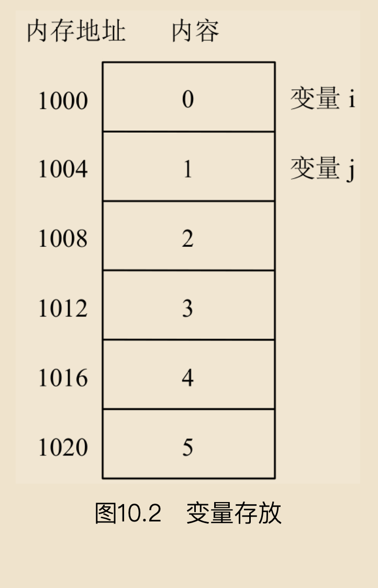

# 指针

指针是C语言的一个重要组成部分，是C语言的核心、精髓所在。用好指针，可以在C语言开发中起到事半功倍的效果。一方面，可以提高程序的编译效率、执行速度，以及动态存储分配；另一方面，可使程序更加灵活，表示和操作各种数据结构更便捷，编写出高质量的应用程序。

## 重难点


## 指针的相关概念

指针是C语言的独特之处，其使用起来十分灵活。使用得当，能显著提高某些程序的效率；使用不当，则很容易造成系统错误。许多程序“挂死”往往都是错误地使用指针造成的。

## 地址与指针

要想弄明白什么是指针，就必须弄清楚数据在内存中是如何存储的，又是如何被读取的。

通常来说，系统会按字节对每个内存单元进行编号，这些内存单元就好比是许多带有编号的小房间，要想使用内存，就需要知道房间编号。例如，定义一个整型变量i需要4个字节，编译器就会为其分配4个内存单元，如图10.1所示，


1000~1003就是对应变量i的4个内存单元地址，其内存放的数值是0。假设又定义了一个整型变量j，则j在内存中的起始地址是1004，因为j同样占4个字节，所以1004~1007单元中保存的是j，其值是1。同理，1008~1012、“1012~1016、1016~1020也同样是3个整型变量对应的内存空间，如图10.2所示。




可见，编译系统为每个变量都分配了一个能满足其类型大小的内存单元地址，访问该地址就能找到对应变量。那么，程序设计中，又该如何访问变量的地址呢？

前面我们学习过取地址符“&”，其作用是获取变量在内存中的地址。例如，&i表示变量i的内存起始地址1000。通过&i可访问变量i指向的内存单元，进而读取变量i。如图10.3所示，“指向”某个变量地址用箭头表示，就好像旅店住宿时某个房间号牌指向某个房间一样。


为了好记忆，我们将变量的地址形象化地称为该变量的“指针”，意思是通过它能访问以它为地址的内存单元。例如，通过地址1000可以访问变量i的地址，进而读取4个字节得到i的值。

## 变量与指针

变量的地址是变量和指针之间的连接纽带。所谓“指向”，是通过地址来体现的。因为指针变量通常指向一个变量的地址，所以将一个变量的地址赋给指针变量后，这个指针变量就“指向”了该变量。例如，将变量i的地址&i存放到指针变量p中，p就指向i，其关系如图10.4所示。


程序代码中一般通过变量名对内存单元进行存取操作，但代码编译后，会将变量名转换为该变量在内存中的存放地址，后续对变量值的存取都是通过该地址进行的。例如，对图10.2中的变量i和变量j进行如下求和操作：

```
i+j;
```

计算机内部的存取流程是：根据变量名与地址的对应关系，找到变量i的地址1000，然后从1000开始读取4个字节数据放到CPU寄存器中，再找到变量j的地址1004，从1004开始读取4个字节的数据放到CPU的另一个寄存器中，通过CPU的加法中断计算出结果。

低级语言（如汇编语言）中一般直接通过地址来访问内存单元，高级语言中一般使用变量名来访问内存单元。C语言作为高级语言，仍然提供了通过地址来访问内存单元的方式。

## 指针变量

一个变量的地址称为该变量的指针。如果有一个变量专门用来存放另一个变量的地址，它就是指针变量。在C语言中有专门用来存放内存单元地址的变量类型，即指针类型。

### 1．指针变量的定义

定义指针变量的一般形式如下：

```
类型说明 * 变量名
```

其中，“*”表示该变量是一个指针变量，“变量名”即为定义的指针变量名，“类型说明”表示本指针变量所指向的变量的数据类型。

### 2．指针变量的赋值


指针变量同普通变量一样，使用前需要先进行定义并赋予具体的值。未经赋值的指针变量不能使用。与其他变量赋值不同，给指针变量赋值只能赋予地址，而不能是其他数据，否则将引起错误。C语言一般用“&变量名”表示某个变量的地址，如&a表示变量a的地址，&b表示变量b的地址。

给一个指针变量赋值可以有以下两种方法。 
 （1）定义指针变量的同时进行赋值。例如：
  ```c
    int a;
    int *p=&a;
  ```

 （2）先定义指针变量，之后再赋值。例如：
  ```c
    int a;
    int *p;
    p=&a;
  ```

  注意： 注意这两种赋值语句的区别。如果先定义指针变量之后再赋值，赋值时指针变量前不再加“*”。

 
### 3．指针变量的引用

引用指针变量是对变量进行间接访问的一种形式。引用指针变量的形式为“*指针变量”，其含义是引用指针变量所指向的值。

#### 误区警示

```
没有初始化的指针变量俗称“野指针”，使用时容易产生错误（导致不合法的内存空间）。良好的编程习惯是在定义指针变量时就将其初始化为NULL，由于NULL处禁止写入，所以一旦有错误，可以将错误造成的危害降到最小。
```

### 4．“&”和“*”运算符

运算符“&”和“*”都是单目运算符。“&”是取地址运算符，用于返回一个操作数的地址。“*”是指针运算符，用于返回指定地址内保存的变量值。

例如，“p=&i;”是将变量i的内存地址赋给指针变量p。“q=*p;”是将指针p指向的变量，即变量i的值赋给q，假如变量i的值是5，则q的值也是5。

### 5．“&*”和“*&”的区别

下面通过两条语句来分析“&*”和“*&”运算的区别。如果有如下语句

```c
int a;
p=&a;
```

- 因为“&”和“*”的优先级相同，按自右而左的方向结合，因此“&*p”先进行“*”运算，“*p”相当于变量a；
- 再进行“&”运算，“&*p”就相当于取变量a的地址。
- “*&a”先进行“&”运算，“&a”就是取变量a的地址，然后执行“*”运算，“*&a”就相当于取变量a所在地址的值，实际就是变量a。

### 指针的自增、自减运算

指针的自增自减运算不同于普通变量的自增自减运算，也就是说，并非简单地加1减1，而是按照它所指向的数据类型的直接长度进行增减。

指针自增自减运算，是按照它所指向的数据类型的直接长度进行增或减。

## 数组与指针

使用数组时，系统需要提供一段连续的内存来存储数组中的各元素，如果把数组的地址赋给指针变量，就可以通过指针变量来引用数组。下面就介绍如何用指针来引用一维数组及二维数组元素。

### 一维数组与指针

定义一维数组时，系统会在内存中为其分配一段存储空间，数组名就是数组在内存中的首地址。若再定义一个指针变量，并将数组的首地址传给指针变量，则该指针就指向了这个一维数组。例如：

```c
int *p,a[10];
p=a;
```

这里a是数组名，也就是数组的首地址，将它赋给指针变量p，也就是将数组a的首地址赋给p。也可以写成如下形式：

```c
int *p,a[10];
p=&a[0];
```

上面的语句是将数组a中首个元素的地址赋给指针变量p。由于a[0]的地址就是数组的首地址，因此上述两条赋值语句的操作效果完全相同。

定义两个指针变量，再定义两个一维数组，将两个数组元素分别赋给两个指针。利用for循环输入两个数组的值（100以内开始5个数和后5个数），再用for循环和指针输出数组值。代码如下：


如下两条语句，都表示将数组首地址赋给指针变量。

```
p=&a[0];
q=b;
```

- p+n与a+n都用于表示数组元素a[n]的地址，即&a[n]。对整个a数组来说，共有5个元素，n的取值为0~4，则数组元素的地址就可以表示为p+0~p+4或a+0~a+4。

- `*(p+n)`和`*(a+n)`都用于表示数组元素a[n]。语句“`printf（"%5d", *(p+i));`”和“printf("%5d",*(q+i));”表示输出数组a、b中对应的元素。

用a+n表示数组元素的地址，*（a+n）表示数组元素，可以将例10.6中输出数组部分的程序代码改成如下形式（运行结果不变）。


表示指针的移动可以使用“++”和“−−”这两个运算符。 
例如，利用“++”运算符可将数组输出部分的代码改写成如下形式：


还可对例10.6程序再进一步改写，将数组的输入、输出都采用指针自增运算实现。改写后的程序代码如下：


比较上面的程序会发现，如果在给数组元素赋值时使用了指针自增运算，而且在输出数组元素时也使用指针变量，则需要加上如下语句：

```
p=a;
q=b;
```

这两行语句的作用是将指针变量p和q重新指向数组a和数组b在内存中的起始位置。若没有该语句，直接使用“*p++”“*q++”的方法进行输出，将会产生错误。

## 二维数组与指针

定义一个3行5列的二维数组，其在内存中的存储形式如图10.15所示，


从中可以看到多种表示二维数组中元素地址的方法。 
对于一个m行n列的二维数组，其元素地址的表示方法如下。
 
- a表示二维数组的首地址，也表示数组第1行的首地址，a+1表示第2行的首地址，a+m表示第m+1行的首地址。 
- a[0]+n表示数组第1行第n+1个元素的地址，a[m]+n表示第m+1行第n+1个元素的地址。 
- &a[0]表示数组第1行的首地址，&a[m]表示第m+1行的首地址。 
- &a[0][0]既可以表示数组第1行1列的首地址，也可以看作整个数组的首地址。&a[m][n]就是第m+1行n+1列元素的地址。 
- 指针也可表示地址，因此通过指针可以引用二维数组中的元素。 
 　*（*（a+m）+n）和*（a[m]+n）含义相同，都表示数组第m+1行第n+1列元素。

如:


在运行结果相同的前提下，可将程序改写成如下形式：


将一个3行5列二维数组的第3行元素输出，具体代码如下：


也可采用*（a+i）+j形式输入二维数组元素，代码如下：

```c
scanf("%d", (a+i)+j); /*使用*(a+i)+j 形式输入二维数组元素*/
```

同样可以采用*（a+i）+j形式输出二维数组元素，代码如下：

```c
printf("%5d", *(*(a+i) + j));
```

**技巧**

```
利用指针引用二维数组的关键是要记住*（a+i）与a[i]是等价的。
```

## 字符串与指针

可以通过两种方式访问一个字符串，一是使用字符数组，二是使用字符指针。

利用字符型指针输出字符串“hello mingri”，具体代码如下:

    ```c
    #include <stdio.h>
    void main()
    {
        char *string = "hello mingri";
        printf("%s", string); //输出字符串
    }
    ```

- 首先定义了字符型指针变量string，用字符串常量“hello mingri”为其赋初值。
- 注意，这里并不是把“hello mingri”中的所有字符存放到string中，只是把该字符串中第一个字符的地址赋给指针变量string，如图10.19所示。


不使用string.h函数库中的函数，利用指针实现字符串复制功能，具体代码如下：

```c
#include <studio.h>

int main() {
    char str1[] = "You are beautiful";
    char str2[] = "";
    _strcopy(str1, str2);
    printf("复制之后的字符串为：%s", str2);
    return 0;
}

void _strcopy(char *str1, char *str2) {
    while (*str1 != "\0") {
        *str2 = *str1;
        str1++;
        str2++;
    }
    *str2 = "\0"; //在字符串2的末尾添加结束符"\0"
}

```

## 指针数组

字符串数组有别于字符数组。字符数组是一个一维数组，而字符串数组是以字符串作为数组元素的数组，可以将其看成一个二维字符数组。下面定义一个简单的字符串数组：

```c
char *country[5][20] = {
    "China",
    "Japan",
    "Russia",
    "Germany",
    "Switzerland"
}
```

通过观察上面定义的字符串数组可以发现，像"China"和"Japan"这样的字符串的长度仅为5，加上字符串结束符也仅为6，而内存中却要给它们分别分配一个20字节的空间，空间浪费较大。为了解决这个问题，可以使用指针数组，使每个指针指向所需要的字符常量。这种方法需要在数组中保存字符指针，虽然也占用空间，但要远少于字符串数组占用的空间。


什么是指针数组呢？一个数组，如果其元素均为指针类型数据，则该数组称为指针数组。也就是说，指针数组中的每一个元素都相当于一个指针变量。一维指针数组的定义形式如下：

```
类型名 数组名[数组长度]
```

英语小测，有一题是根据汉语填写英语。语文、数学、英语、化学、生物、物理的英语分别为Chinese、math、English、chemistry、biology和physics，用指针数组输出对应的英文。

```c
#include <stdio.h>
int main() {
    int i;
    char *test[] = {
        "Chinese",
        "Math",
        "English",
        "Chemistry",
        "Biology",
        "Physics"
    };

    for(int i = 0; i < 6; i++) {
        printf("%s\n", test[i]);
    }
    return 0;
}
```

## 指向指针的指针

一个指针可以指向整型变量、实型变量、字符型变量，当然也可以指向另一个指针，此时称其为指向指针的指针。如图10.23所示，整型变量i的地址是&i，将其值传递给指针变量p1，则p1指向i；同时，将p1的地址&p1传递给p2，则p2指向p1。这里的p2就是指向指针变量的指针。


指向指针的指针定义如下：

```
类型标识符 **指针变量名;
```

例如，“int **p;”的含义为定义一个指针变量p，它指向另一个指针变量，该指针变量又指向一个基本整型变量。由于指针运算符“*”自右至左结合，所以上述定义相当于“int *（*p）;”。

知道如何定义指向指针的指针后，可以将图10.23用图10.24更形象地表示出来。


用指向指针的指针输出一维数组中其值为偶数的元素，并统计偶数的个数，具体代码如下：


程序中，将数组a的首地址赋给指针变量p1，又将指针变量p1的地址赋给p2，要通过这个双重指针变量p2访问数组中的元素，就要一层层地来分析。

首先看*p2的含义，*p2指向的是指针变量p1所存放的内容，即数组a的首地址，要想取出数组a中的元素，就必须在*p2前面再加一个指针运算符“*”。


根据前面讲过的指针的用法，还可将上例改写成如下形式：


## 指针变量作函数参数

通过前面的介绍可知，整型变量、实型变量、字符型变量、数组名和数组元素等均可作为函数参数。此外，指针型变量也可以作为函数参数，这里具体进行介绍。

```c
void swap(int *a, int *b) {
    int temp = *a;
    *a = *b;
    *b = temp;
} 
```

swap函数的两个形参被传入了两个地址值，也就是传入了两个指针变量。在swap函数的函数体内使用整型变量tmp作为中间变量，将两个指针变量所指向的数值进行交换。

C语言中实参变量和形参变量之间的数据传递是单向的“值传递”方式。指针变量作函数参数也是如此，调用函数不可能改变实参指针变量的值，但可以改变实参指针变量所指向变量的值。

## 返回指针值的函数

指针变量也可以指向一个函数。函数在编译时会被分配一个入口地址，该入口地址就称为函数的指针。可以用一个指针变量指向函数，然后通过该指针变量调用此函数。 
一个函数可以带回一个整型值、字符值、实型值等，也可以带回指针型的数据，即地址。其概念与之前介绍的类似，只是带回的值的类型是指针类型而已。返回指针值的函数简称为指针函数。

定义指针函数的一般形式如下：

```
类型名 *函数名(参数表列);
```

下面的定义中，fun是函数名，调用它以后能得到一个指向整型数据的指针。x和y是函数fun的形式参数，这两个参数均为基本整型。函数名前面有一个“*”，表示此函数是指针型函数。类型说明是int，表示返回的指针指向整型变量。

```
int *fun(int x, int y)
```

## 指针数组作main函数的参数


main函数是运行所有程序的入口，由系统调用。当处于操作命令状态下，输入main所在的文件名，系统即调用main函数。 

main函数一般是没有参数的。但实际上，main函数也可以是有参函数，其带参形式如下：

```
main(int argc,char *argv[])
```

有两个参数，一个整型和一个指针数组。当一个C源程序经过编译、链接后，会生成扩展名为.exe的可执行文件，该文件可直接在操作系统下运行。对于main函数来说，其实际参数和命令是一起给出的，也就是一个命令行包括命令名和需要传给main函数的参数。命令行的一般形式如下：

```
命令名  参数1 参数2 … 参数n
```

其中，"命令名"就是可执行文件的文件名，命令名和其后参数之间须用空格分隔

命令行与main函数的参数间存在一定关系。假设命令行为：

```
file1 happy bright glad
```

这里，file1为文件名，就是file1.c经编译、链接后生成的可执行文件file1.exe，其后跟3个参数。以上命令行与main函数中的形式参数关系如下:

argc记录了命令行中命令与参数的个数，这里包括file1、happy、bright和glad，共4个，指针数组的大小由参数的值决定，这里为char *argv[4]，该指针数组的取值情况如图10.36所示。


利用指针数组作main函数的形参，可以向程序传送命令行参数。

```
参数字符串的长度是不定的，参数数量也是任意的，并不规定具体个数。
```