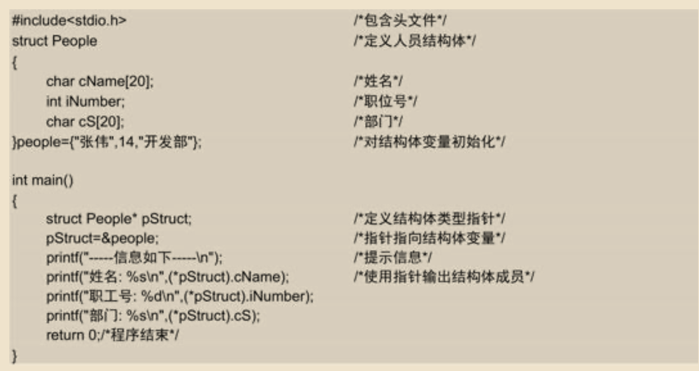

# 结构体和共用体

## 重难点


## 结构体

许多基本数据类型，如整型int、字符型char等，还学习了数组这种构造类型。数组中，所有的数据都是同一类型，调用起来非常方便。 

除此以外，有时我们需要定义一些复杂的数据类型，它可能包括多个不同属性，每个属性需要用不同的类型来表示。该怎么实现呢？C语言中，可以把一些有内在联系的不同变量组织起来，封装成一个整体，即定义成一个结构体（structure），以此来表示一种新的数据类型。之后，就可以像处理基本数据类型那样，对结构体类型进行各种操作。

### 结构体类型的声明

结构体是一种构造类型，它由若干成员组成。其成员可以是一个基本数据类型，也可以是另一个构造类型。声明一个结构体的过程，就是创建一种新的类型名的过程。

声明结构体时使用的关键字是struct，其一般形式如下：

```
struct 结构体名 {
    成员列表;
};
```

- 关键字struct表示声明的是一个结构体，
- “结构体名”表示要创建的新类型名，
- 大括号中的“成员列表”包括构成该结构体的所有成员。
- 注意，声明结构体时大括号后的分号“;”不能遗漏。

如:


上述代码使用关键字struct声明了一个名为Product的结构体类型，在结构体中定义了6个变量，分别表示产品名称、形状、颜色、功能、价格和产地，并为其设置了相对应的类型。

### 结构体变量的定义

声明完结构体后，就创建了一种新的类型名，后续就可以使用这种新的类型名定义变量。定义结构体变量的方式有如下3种。

（1）先声明结构体类型，再定义变量。

例如，使用前面声明的Product结构体类型定义两个结构体变量product1和product2，代码如下：


struct Product是结构体类型名，而product1和product2是结构体变量名。既然都是使用Product类型定义的变量，那么这两个变量就具有相同的结构。

#### 技巧

```
在一些大型开发中，为了便于修改和使用，常常将结构体类型的声明放在一个头文件中，这样在其他源文件中如果需要使用该结构体类型，则可以用#include命令将该头文件包含到源文件中。
```

定义一个基本类型的变量与定义一个结构体类型变量的不同之处在于：定义结构体变量不仅要求指定变量为结构体类型，而且要求指定为某一特定的结构体类型，如struct Product；而定义基本类型的变量时（如整型变量），只需要指定int型即可。

#### 说明

```
定义结构体变量后，系统就会为其分配内存单元。例如，product1和product2在内存中各占84字节（10+20+10+20+4+20）。
```

（2）声明结构类型的同时定义结构体变量。例如：


（3）直接定义结构体类型变量（此时不需要给出结构体名称）。例如：


需要注意的是，类型与变量是不同的。例如，只能对变量进行赋值操作，不能对类型进行操作。这就像使用int型定义变量iInt，可以为iInt赋值，但不能为int赋值。编译时，不对类型分配空间，只对变量分配空间。

结构体的成员仍然可以是结构体类型的变量。例如：


以上代码声明了一个date结构体类型，成员包括年、月、日；还声明了一个student结构类型，并且定义了两个结构体变量student1和student2。在struct student结构体类型中，可以看到有一个成员是表示学生的出生日期，使用的是struct date结构体类型。

(4) 使用typedef定义结构体，语法如下:
```
typedef struct {
    // structure members
    data_type member1;
    data_type member2;
    ...
} AliasName;
```
例如 ：
```
#include <stdio.h>

// Define a struct using typedef
typedef struct {
    int x;
    int y;
} Point;

int main() {
    // Declare a variable of the typedef-ed struct
    Point p1;

    // Access and modify the members
    p1.x = 10;
    p1.y = 20;

    // Print the values
    printf("Point p1: x = %d, y = %d\n", p1.x, p1.y);

    return 0;
}

```
还可以使用这种定义方式如:

```
#include <stdio.h>

// Named struct with typedef
typedef struct Point {
    int x;
    int y;
} Point;

int main() {
    Point p1 = {10, 20};
    printf("Point p1: x = %d, y = %d\n", p1.x, p1.y);
    return 0;
}

```

### 结构体变量的引用

定义了结构体类型变量以后，就可以引用该变量，引用形式为“结构变量名.成员名”。例如：

```
product1.cName="Icebox";
product1.iPrice=2000;
```

对结构体变量进行赋值、存取或运算，实质上就是对结构体成员进行操作。上面的赋值语句就是对product1结构体变量中的成员cName和iPrice两个变量进行赋值。 

需要注意的是，不能直接将结构体变量作为一个整体进行输入和输出。例如，不能将product1和product2采用如下方式输出：

```
printf("%s%s%s%d%s",product1);
printf("%s%s%s%d%s",product2);
```

如果成员本身又属于一个结构体类型，就需要使用若干个成员运算符“.”找到最低一级的成员，对其进行赋值、存取以及运算操作。例如，对上面定义的student1变量中的出生日期进行赋值：

```
student1.birthday.year=1986;
student1.birthday.month=12;
student1.birthday.day=6;

```

**注意**

```
不能使用student1.birthday访问student1变量中的成员birthday，因为birthday本身也是一个结构体变量。
```

结构体变量的成员可以像普通变量一样，进行各种运算。例如：

```
product2.iPrice=product1.iPrice+500;
product1.iPrice++;
```

因为“.”运算符的优先级最高，所以product1.iPrice++是product1.iPrice成员进行自加运算，而不是先对iPrice进行自加运算。

还可以对结构体变量成员的地址进行引用，也可以对结构体变量的地址进行引用，例如：

```
scanf("%d", &product1.iPrice); /*输入成员iPrice的值*/
printf("%o", &product1); /*输出product1的首地址*/

```

### 结构体类型的初始化

结构体类型与其他基本类型一样，也可以在定义结构体变量时指定初始值。例如：


定义的变量后面使用等号，初始化值放在大括号中，数据顺序与结构体的成员列表顺序一致。

本实例演示了两种初始化结构体的方式，一种是在声明结构体及定义变量的同时进行初始化，另一种是在定义结构体变量后进行初始化。


（1）声明结构体时定义student1并对其初始化，待赋值内容放在后面大括号中，每个数据都与结构体的成员数据相对应。 

（2）在main函数中使用声明的结构体类型struct Student定义变量student2，并且进行初始化的操作。

（3）最后将两个结构体变量中的成员进行输出，并比较二者数据的区别。

注意：

*并不是所有的结构体成员都可以赋值，如果某个成员使用const做了限定，就不可以再对其赋值。*

### 结构体数组

当要定义10个整型变量时，可以使用数组的形式。当要定义10个结构体类型变量时，也可以使用数组的形式，这时的数组被称为结构体数组。结构体数组与普通数组的区别在于：数组中的每个元素都是根据要求定义的结构体类型，而不是基本类型。

定义结构体数组的方式与定义结构体变量的方法相同，其一般形式如下：

```
struct 结构体名 {
    成员列表;
} 数组名;
```

例如，定义一个学生信息的结构体数组，其中包含5个学生的信息，代码如下：

```
struct Student {     /*学生结构体*/
    char cName[20];  /*姓名*/
    int iNumber;     /*学号*/
    char cSex;    /*性别*/
    int iGrade;      /*年级*/
} student[5];        /*定义结构体数组*/
```

上述代码中，定义结构体类型的同时定义了结构体数组student[5]。除此以外，也可以先声明结构体类型再定义结构体数组：
```
struct Student student[5]; /*广定义结构体数组*/
```

或者直接定义结构体数组（此时不需要给出结构体名称）：

```
struct {         /*学生结构体*/
    ...          /*成员列表*/
} student[5];    /*定义结构体数组*/
```

上面的代码都定义了一个结构体数组，其中每个元素都为struct Student类型的数据，每个数据中又有4个成员变量，如图11.4所示


数组中各数据在内存中的存储是连续的，如图11.5所示。


### 初始化结构体数组

初始化结构体数组的一般形式如下：
```
struct 结构体名 {
    成员列表;
} 数组名 = {初始值列表};
```
例如，为学生结构体数组进行初始化操作，代码如下：


为数组进行初始化时，最外层的大括号表示列出的是数组中的元素。因为每个元素都是结构体类型，所以也都使用大括号括起来，其中包含每一个结构体元素的成员数据。

定义数组student时，也可以不指定数组中的元素个数，这时编译器会根据数组后面的初始化值列表中给出的元素个数，来确定数组中元素的个数。例如：

```
student[ ]={…};
```
同样，也可以先声明结构体数组，后续再进行初始化。

## 结构体指针

一个指向结构体变量的指针，指向的是结构体变量的起始地址。除此以外，指针变量还可以指向结构体数组以及数组中的元素。

### 指向结构体变量的指针

定义结构体指针的一般形式如下：

```
结构体类型 *指针名;
```

例如，定义一个指向struct Student结构类型的pStruct指针变量，代码如下：

```
struct Student *pStruct;
```

指针指向的是结构体变量的地址，因此可以使用指针来访问结构体中的成员，方式有两种。 

- 第一种方法是使用成员运算符“.”引用结构成员，形式为“（*pStruct）.成员名”。例如，pStruct指针指向student1结构体变量，可以采用如下方式引用其中的成员。

    ```
    (*pStruct).iNumber=12061212;
    ```

    注意，`*pStruct`一定放在括号内，这是因为成员运算符“.”的优先级最高，如果不使用括号，就会先执行“.”运算然后才是“*”运算。

    例如:
    

    
    （1）首先声明结构体类型People，同时定义变量people并进行初始化。 
    
    （2）定义结构体指针变量pStruct，然后执行“pStruct=&people;”使指针指向people变量。

    （3）输出消息提示，然后在printf函数中使用指针引用成员变量，将员工信息输出。

- 第二种方法是使用指向运算符“->”引用结构成员，形式为“pStruct ->成员名”。例如，使用指向运算符引用一个变量的成员

    ```
    pStruct->iNumber=12061212;
    ```
    **注意**

    - 在使用“->”引用成员时，要注意分析以下情况。 
  pStruct->iGrade：表示指向的结构体变量中成员iGrade的值。

    - pStruct->iGrade++：表示指向的结构体变量中成员iGrade的值，使用后该值加1。 
    　
    - ++pStruct->iGrade：表示指向的结构体变量中成员iGrade的值加1，计算后再进行使用。


总结一下，假如student为结构体变量，pStruct为指向结构体变量的指针，则以下3种引用形式的效果是完全等价的。 
 　
- student.成员名。 
- (*pStruct).成员名。 
- pStruct->成员名。

例子:


(1) 使用strcpy函数将一个字符串常量复制到成员变量中。使用strcpy函数前，要在程序中包含头文件string.h。 **注意: 为什么要用strcpy？你不能直接使用 = 操作符给它赋值，因为数组是不可赋值的。**
 
(2)为成员赋值时，使用的是“->”运算符引用的成员变量，在程序的最后使用结构体变量和“.”运算符直接将成员的数据进行输出。


### 指向结构体数组的指针

结构体指针变量指向结构体数组时，指针变量的值就是结构体数组的首地址。还可以直接指向结构体数组中的元素，这时指针变量的值就是该结构体数组元素的首地址。

### 结构体作为函数参数

