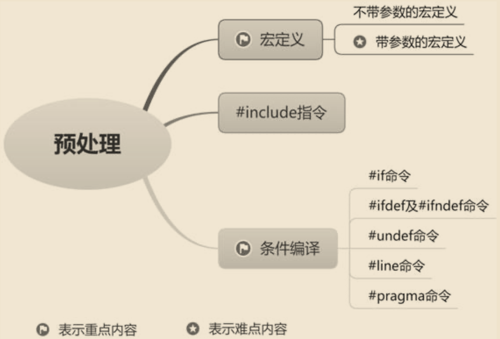
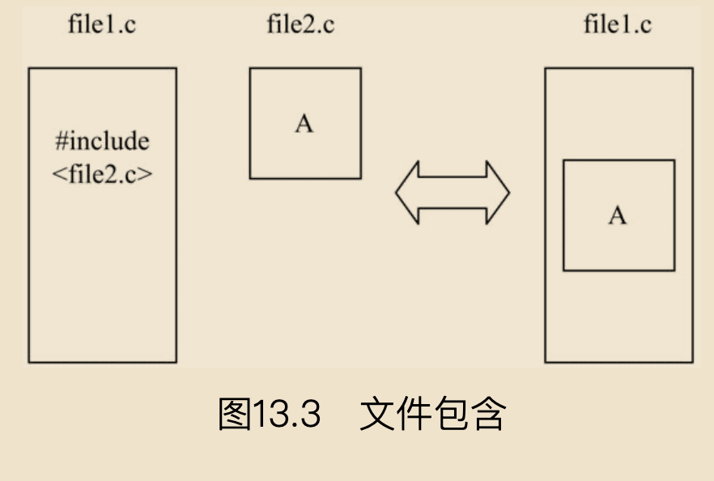

# 预处理

预处理是C语言特有的功能，包括宏定义、条件编译等。使用预处理功能可使程序的修改、阅读、移植和调试更加方便，也更利于实现模块化程序设计。



## 宏定义

宏定义是预处理命令的一种，它提供了一种可以替换源代码中字符串的机制。简单来说，宏定义指令#define用来定义一个标识符和一个字符串，以这个标识符来代表这个字符串，在程序中每次遇到该标识符时就用所定义的字符串替换它。宏定义的作用相当于给指定的字符串起了一个别名。

```
C语言并没有规定#define必须写在函数外面，只是规定这条命令必须单独占一个完整的逻辑行。其作用范围是#define出现的位置到所在源文件结束，或到相应的#undef预处理指令处。如果需要#define预处理命令仅在某个函数内有效，完全可以把它写在函数内。
```

### 不带参数的宏定义

首先来讲解不带参数的宏定义，其一般形式如下：

```
#define  宏名  字符串
```

- "#"表示这是一条预处理命令。 
- 宏名是一个标识符，必须符合C语言中对标识符的限定。宏名要简单且意义明确，一般习惯用大写字母表示，以便与变量名相区别。 
- 字符串可以是常数、表达式、格式字符串等。

使用#define进行宏定义的好处是：当需要改变一个常量时，只需改变#define命令行，整个程序的常量都会改变，大大提高了程序的灵活性。

宏名定义后，即可成为其他宏名定义中的一部分。例如，下面代码定义了正方形的边长SIDE、周长PERIMETER及面积AREA的值。

```
#define  SIDE  5
#define  PERIMETER  4*SIDE
#define  AREA  SIDE*SIDE
```

前面强调过，宏替换是以字符串代替标识符。因此，可定义一个标准的邀请语：

```
#define  STANDARD  "You are welcome to join us."
printf(STANDARD)；
```

编译程序时，遇到标识符STANDARD，就用"You are welcome to join us."替换。

关于不带参数的宏定义，有以下几点需要注意。 
 　
 - 如果在字符串中出现宏名，则不进行替换。例如：

    ```
    #include<stdio.h>
    #define TEST "this is an example"
    main() {
    char exp|30]="This TEST is not that TEST": /*定义字符数组并赋初值*/
    printf(%sin",exp);
    }
    ```

    上述代码的输出结果如下所示:
    ```
    This TEST is not that TEST
    ```
    可见，字符串中的两处TEST并没有用"this is an example"替换。


    
- 如果字符串多于一行，可在行末用反斜杠“\”进行续行。

- `#define`命令出现函数外时，宏名的有效范围为定义命令之后到此源文件结束。

        通常会将所有#define放到文件开始处或独立的文件中，而不是将它们分散到整个程序中。

- 可以用#undef命令终止宏定义的作用域，如:

    ```
    #include <stdio.h>
    #define TEST "this is an example"
    main()
    {
        printf(TEST):
        #undef TEST
    }
    ```

- 宏定义是一种预处理命令，不同于变量定义，它只做字符替换，而不分配内存空间。

### 带参数的宏定义

带参数的宏定义，不仅要进行字符串替换，还要进行参数替换。其一般形式如下：

```
#define 宏名(参数表)字符串
```

例如：两个数混合运算

```
#include <stdio.h>
#define MIX(a,b) ((a)*(b)+(b)) /*定义，求两个数的混合运算*/
main()
{
    int x=5,y=9;
    printf("x,y;\n");
    printf("%d,%d\n", x, y);
    printf("the min number is: %d\n", MIX(x,y)); /*宏定义调用*/
}
```

程序运行结果：
```
x，Y：
5, 9
the min number is:54
```
可见，编译程序时，printf语句将被替换为如下形式:
```
printf("the min number is: %d",((a)*(b)+(b)));
```

用宏替换代替实在的函数，好处是可以提升代码速度（不再存在函数调用），代价是由于重复编码，增加了程序长度。

对于带参数的宏定义，有以下几点需要注意。

- 宏定义时，参数要加括号。如不加括号，则结果可能是正确的，也可能是错误的。

- 宏扩展必须使用括号来保护表达式中优先级低的操作符，以确保调用时能达到预期效果。

- 对带参数的宏的展开，只是用宏名后括号内的实参字符串代替#define命令行中的形参。

- 宏定义时，宏名与带参数的括号之间不要加空格，否则会将空格以后的字符都作为替代字符串的一部分。

- 在带参宏定义中，形式参数不分配内存单元，因此不必做类型定义。

### `#include命令`

使用#include命令可将其他源文件的内容包含进来，即将其他文件包含到本文件之中。被读入的源文件必须用双引号或尖括号括起来。例如，下面两行代码均表示包含了标准输入／输出库文件stdio.h，后续可直接使用其中的函数而不用再定义。

```
#include "stdio.h"
#include <stdio.h>
```

双引号和尖括号的区别如下。

- 尖括号：此为标准方式，系统会直接到存放C库函数头文件所在的目录中寻找要包含的文件。 
- 双引号：系统先在用户当前目录中寻找要包含的文件，若找不到，再到存放C库函数头文件所在的目录中寻找要包含的文件。file1.c file2.c file1.c

通常情况下，
 - 包含库函数时，使用尖括号可以节省查找时间；
 - 包含用户自定义文件时，使用双引号比较快捷。
 - 用户自己编写的文件通常保存在当前目录中，如果文件不在当前目录中，双引号内还可以给出文件路径。

将文件直接嵌入#include命令内也是可行的，这种方式称为嵌套的嵌入文件。嵌套层次依赖于具体实现，如图13.3所示。




经常用在文件头部的被包含文件称为标题文件或头文件，一般以.h为后缀。一般情况下，将如下内容放到.h文件中。

- 宏定义。 
- 结构、联合和枚举声明。 
- typedef声明。 
- 外部函数声明。 
- 全局变量声明。

关于文件包含，有以下几点需要注意。

- 一个#include命令只能指定一个被包含的文件。
- 文件包含是可以嵌套的，即在一个被包含文件中还可以包含另一个被包含文件。
- 若age.c中包含文件age.h，则预编译后两者会成为一个文件。如果age.h中有全局静态变量，则该全局变量在age.c文件中也有效，这时不需要再用extern声明。


### 条件编译

C语言预处理器提供了条件编译功能。一般情况下，源程序中的所有行都会参加编译。如果希望其中一部分内容只在满足一定条件时才进行编译，这时就需要使用条件编译命令。使用条件编译可以非常方便地处理程序的调试版本和正式版本，同时还会增强程序的可移植性。

#### `#if命令`

`#if`的基本含义是：如果#if命令后的参数表达式为真，则编译#if到#endif之间的程序段，否则跳过这段程序。#endif命令用来表示#if段的结束。 

`#if`命令的一般形式如下：
```
#if常数表达式
    语句段
#endif
```

如果常数表达式为真，则该段程序被编译，否则跳过该段程序（不编译）。

`#else`的作用是为#if为假时提供另一种选择，其作用和前面讲过的条件判断中的else相近。

`#elif`指令用来建立“如果……或者如果……”这样阶梯状多重编译操作选择，与多分支if语句中的else if类似。

`#elif`的一般形式如下：

```
#if 表达式1

语句段1

#elif 表达式2

语句段2

#elif表达式3

语句段 3

#elif 表达式n

语句段n

#endif
```

#### `#ifdef`及`#ifndef`命令

在#if条件编译命令中，需要判断符号常量所定义的具体值。但有时并不需要判断具体值，只需要知道这个符号常量是否被定义了，这时可以采用另一种条件编译的方法，即#ifdef与#ifndef命令，分别表示“如果有定义”及“如果无定义”。 
 
`#ifdef`的一般形式如下：

```
#ifdef 宏替换名
语句段
#endif
```

其含义是：如果宏替换名已被定义过，则对语句段进行编译；如果未定义#ifdef后面的宏替换名，则不对语句段进行编译。#ifdef可与#else连用，形式如下：

```
#ifdef 宏替换名
    语句段 1
#else
    语句段2
#endif
```

其含义是：如果宏替换名已被定义过，则对语句段1进行编译；如果未定义#ifdef后面的宏替换名，则对语句段2进行编译


`#ifndef`的一般形式如下：

```
#indef 宏替换名
    语句段
#endif
```

其含义是：如果未定义#ifndef后面的宏替换名，则对语句段进行编译；如果定义#ifndef后面的宏替换名，则不执行语句段。同样，#ifndef也可以与#else连用，一般形式如下：

```
#ifndef 宏替换名
    语句段1
#else
    语句段2
#endif
```

其含义是：如果未定义#ifndef后面的宏替换名，则对语句段1进行编译；如果定义#ifndef后面的宏替换名，则对语句段2进行编译。

#### `#undef`命令

使用#undef命令可以删除事先定义好的宏定义。其一般形式如下： 

```
#undef 宏替换名
```

使用#undef命令可将宏名限制在特定的代码段中。例如：

```
#define MAX_SIZE 100
char array[MAX_SIZE];
#undef MAX_SIZE
```

上述代码中，首先使用#define定义标识符MAX_SIZE，然后使用#undef删除宏定义。也就是说，遇到#undef语句之前，MAX_SIZE的定义都是有效的。

#### `#line`命令

`#line`命令用于显示_LINE_与_FILE_的内容。_LINE_用于存放当前编译行的行号，_FILE_用于存放当前编译的文件名。#line命令的一般形式如下：

```
#line 行号["文件名"]
```

其中，行号为任一正整数，可选的文件名为任意有效文件标识符。行号为源程序中当前行号，文件名为源文件的名字。#line命令主要用于调试及其他特殊应用。

```
#line 100 "13.7.C" 
#include <stdio.h>

int main()
{
    printf("1.当前行号：%d\n", __LINE__);
    printf("2.当前行号：%d\n", __LINE__);
    return 0;
}
```

#### `#pragma`命令

1．#pragma命令 

`#pragma`命令用于设定编译器状态，或指示编译器完成一些特定动作。一般形式如下：

```
#pragma 参数
```

- message参数：在编译信息窗口中输出的相应信息。 
- code_seg参数：设置程序中函数代码存放的代码段。 
- once参数：保证头文件被编译一次。

2．预定义宏名

ANSI标准说明了以下5个预定义宏替换名。 
`__LINE__`：当前被编译代码的行号。 
`__FILE__`：当前源程序的文件名称。 
`__DATE__`：当前源程序的创建日期。 
`__TIME__`：当前源程序的创建时间。 
`__STDC__`：判断当前编译器是否为标准C。其值为1，是标准C，否则不是标准C。
