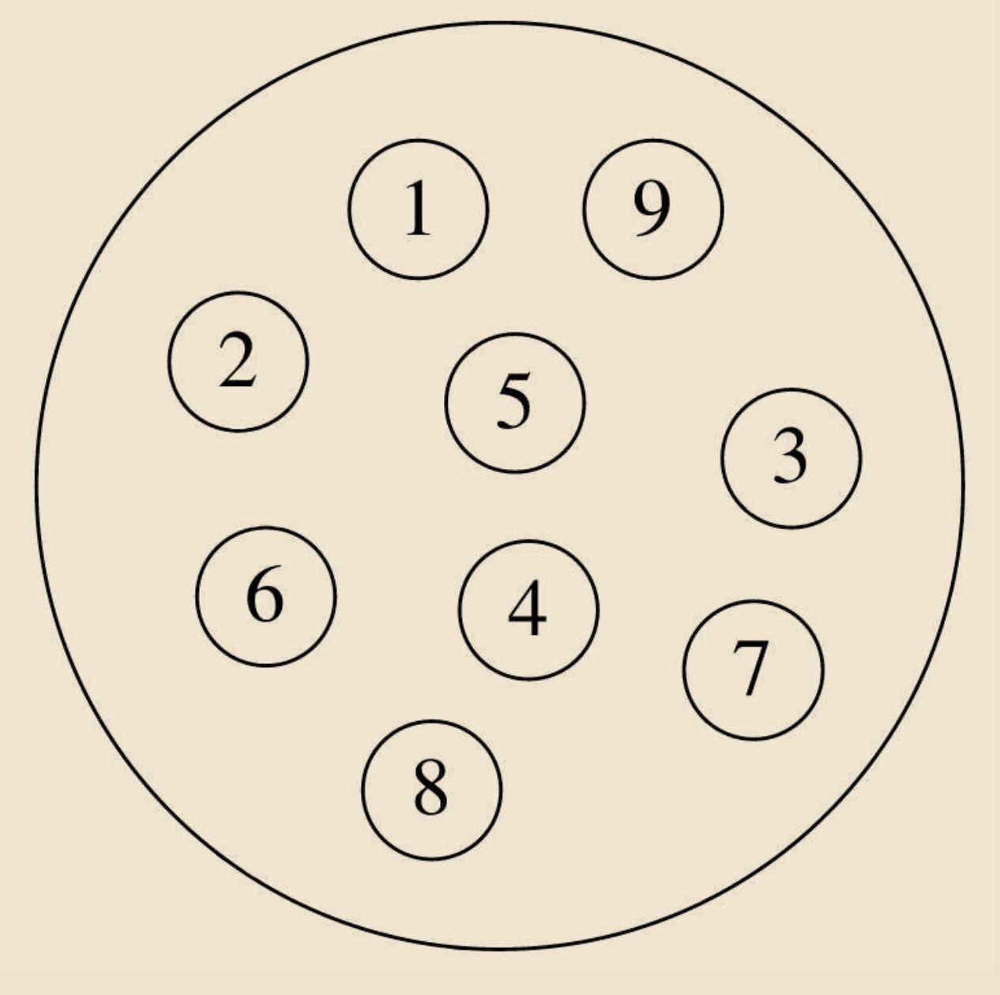
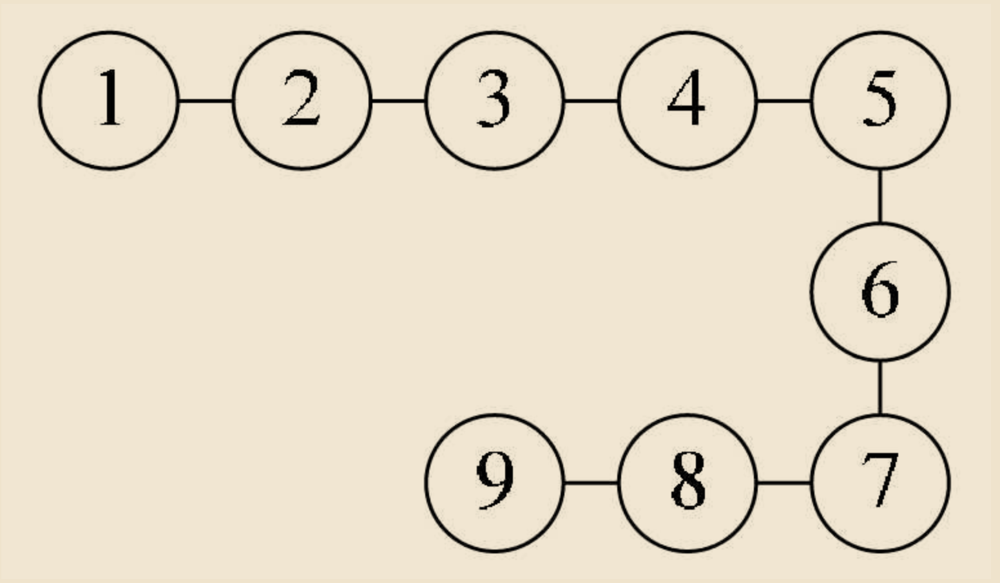
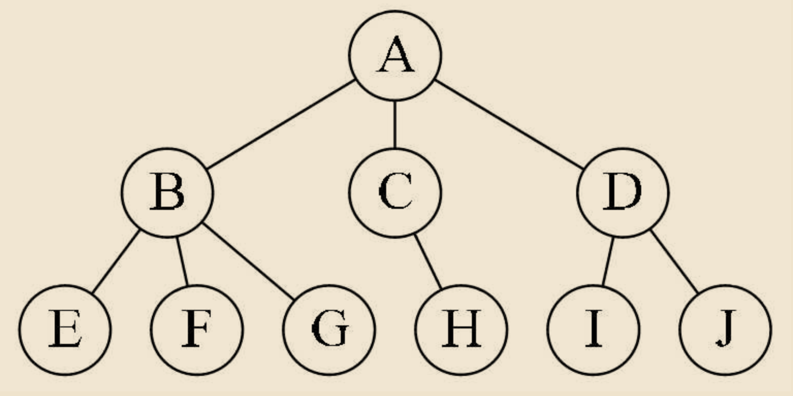
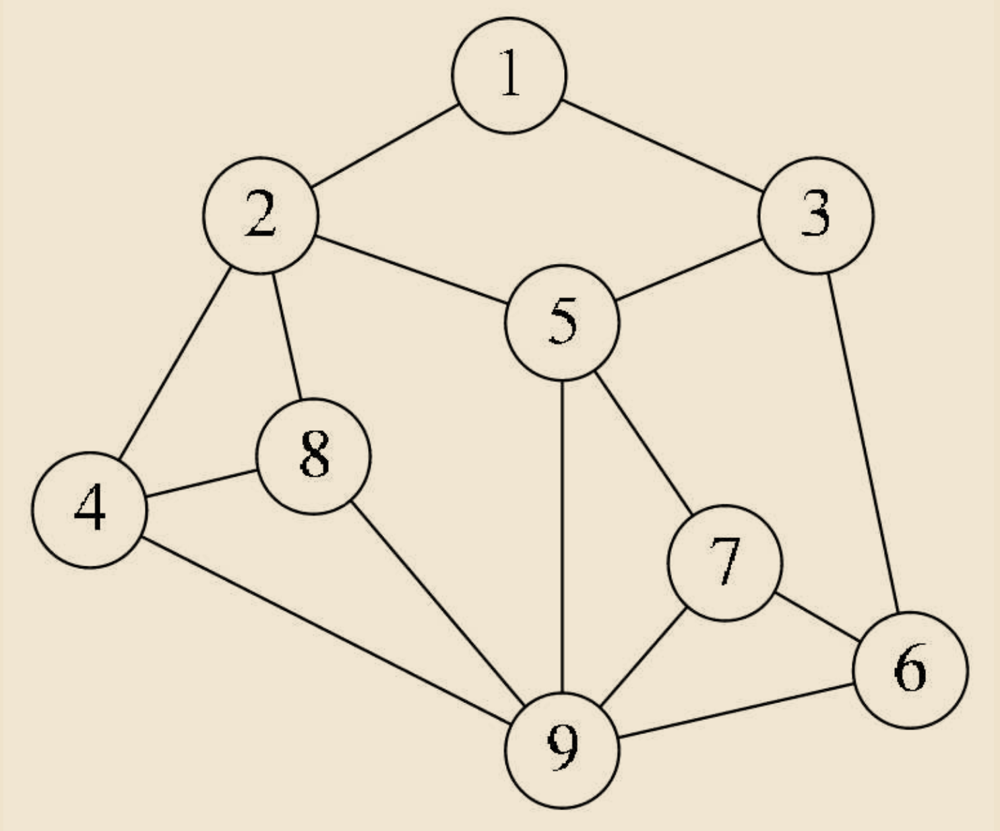
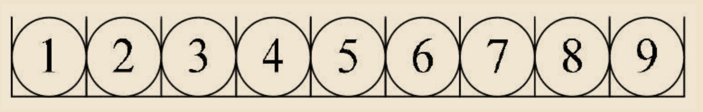
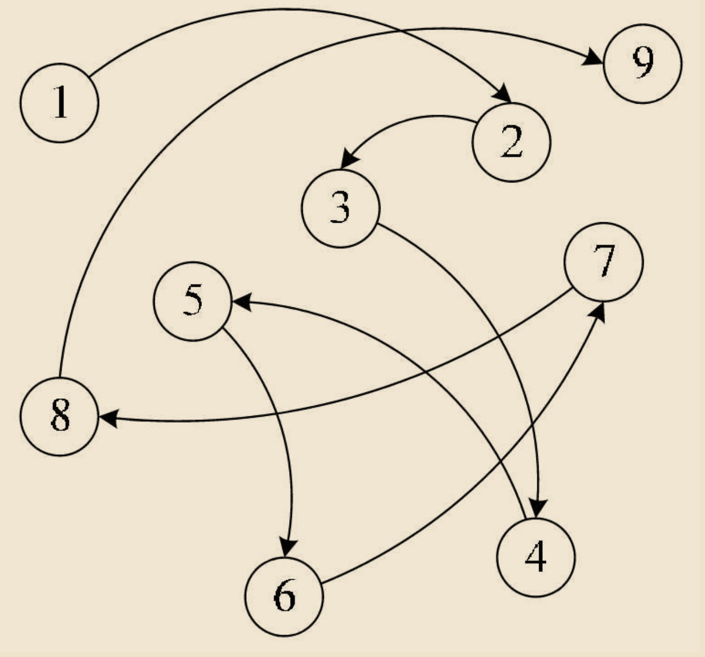
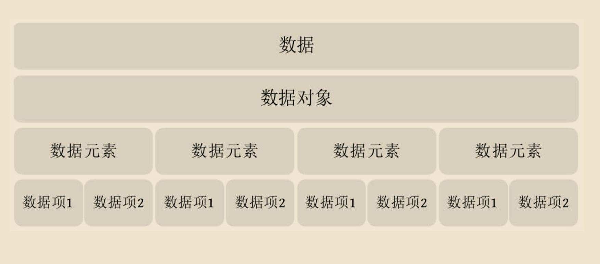
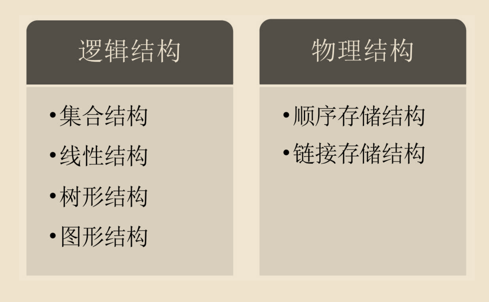

# 数据结构

## 基本概念和术语

程序设计=数据结构+算法

### 数据

数据：是描述客观事物的符号，是计算机中可以操作的对象，是能被计算机识别，并输入给计算机处理的符号集合。数据不仅仅包括整型、实型等数值类型，还包括字符及声音、图像、视频等非数值类型。

比如我们现在常用的搜索引擎，一般会有网页、MP3、图片、视频等分类。MP3就是声音数据，图片当然是图像数据，视频就不用说了，而网页其实指的就是全部数据的集合，包括最重要的数字和字符等文字数据。


也就是说，我们这里说的数据，其实就是符号，而且这些符号必须具备两个前提：

- 可以输入到计算机中。
- 能被计算机程序处理。

对于整型、实型等数值类型，可以进行数值计算。
对于字符数据类型，就需要进行非数值的处理。而声音、图像、视频等其实是可以通过编码的手段变成字符数据来处理的。

### 数据元素

数据元素：是组成数据的、有一定意义的基本单位，在计算机中通常作为整体处理。也被称为记录。


比如，在人类中，什么是数据元素呀？当然是人了。


畜类呢？哈，牛、马、羊、鸡、猪、狗等动物当然就是禽类的数据元素。

### 数据项

数据项：一个数据元素可以由若干个数据项组成。

比如人这样的数据元素，可以有眼、耳、鼻、嘴、手、脚这些数据项，也可以有姓名、年龄、性别、出生地址、联系电话等数据项，具体有哪些数据项，要视你做的系统来决定。


数据项是数据不可分割的最小单位。在数据结构这门课程中，我们把数据项定义为最小单位，是有助于我们更好地解决问题。所以，记住了，数据项是数据的最小单位。但真正讨论问题时，数据元素才是数据结构中建立数据模型的着眼点。就像我们讨论一部电影时，是讨论这部电影角色这样的“数据元素”，而不是针对这个角色的姓名或者年龄这样的“数据项”去研究分析。

### 数据对象

数据对象：是性质相同的数据元素的集合，是数据的子集。

什么叫性质相同呢，是指数据元素具有相同数量和类型的数据项，比如，还是刚才的例子，人都有姓名、生日、性别等相同的数据项。

既然数据对象是数据的子集，在实际应用中，处理的数据元素通常具有相同性质，在不产生混淆的情况下，我们都将数据对象简称为数据。

### 数据结构

结构，简单的理解就是关系，比如分子结构，就是说组成分子的原子之间的排列方式。严格点说，结构是指各个组成部分相互搭配和排列的方式。在现实世界中，不同数据元素之间不是独立的，而是存在特定的关系，我们将这些关系称为结构。那数据结构是什么？**数据结构：是相互之间存在一种或多种特定关系的数据元素的集合。**

### 逻辑结构与物理结构

按照视点的不同，我们把数据结构分为逻辑结构和物理结构。

#### 逻辑结构

逻辑结构：是指数据对象中数据元素之间的相互关系。其实这也是我们今后最需要关注的问题。逻辑结构分为以下四种：

1．集合结构

集合结构：集合结构中的数据元素除了同属于一个集合外，它们之间没有其他关系。各个数据元素是“平等”的，它们的共同属性是“同属于一个集合。“数据结构中的集合关系就类似于数学中的集合（如图1-5-1所示）。


2．线性结构

线性结构：线性结构中的数据元素之间是一对一的关系（如图1-5-2所示）。


3．树形结构

树形结构：树形结构中的数据元素之间存在一种一对多的层次关系（如图1-5-3所示）。



4．图形结构

图形结构：图形结构的数据元素是多对多的关系（如图1-5-4所示）。




我们在用示意图表示数据的逻辑结构时，要注意两点:


- 将每一个数据元素看做一个结点，用圆圈表示。

- 元素之间的逻辑关系用结点之间的连线表示，如果这个关系是有方向的，那么用带箭头的连线表示。


从之前的例子也可以看出，逻辑结构是针对具体问题的，是为了解决某个问题，在对问题理解的基础上，选择一个合适的数据结构表示数据元素之间的逻辑关系。

### 物理结构

物理结构（存储结构）：是指数据的逻辑结构在计算机中的存储形式。

数据是数据元素的集合，那么根据物理结构的定义，实际上就是如何把数据元素存储到计算机的存储器中。存储器主要是针对内存而言的，像硬盘、软盘、光盘等外部存储器的数据组织通常用文件结构来描述。


数据的存储结构应正确反映数据元素之间的逻辑关系，这才是最为关键的，如何存储数据元素之间的逻辑关系，是实现物理结构的重点和难点。


数据元素的存储结构形式有两种：**顺序存储**和**链式存储**。

1．顺序存储结构

顺序存储结构：是把数据元素存放在地址连续的存储单元里，其数据间的逻辑关系和物理关系是一致的（如图1-5-5所示）。


这种存储结构其实很简单，说白了，就是排队占位。大家都按顺序排好，每个人占一小段空间，大家谁也别插谁的队。我们之前学计算机语言时，数组就是这样的顺序存储结构。当你告诉计算机，你要建立一个有9个整型数据的数组时，计算机就在内存中找了片空地，按照一个整型所占位置的大小乘以9，开辟一段连续的空间，于是第一个数组数据就放在第一个位置，第二个数据放在第二个，这样依次摆放。

2．链式存储结构

链式存储结构：是把数据元素存放在任意的存储单元里，这组存储单元可以是连续的，也可以是不连续的。数据元素的存储关系并不能反映其逻辑关系，因此需要用一个指针存放数据元素的地址，这样通过地址就可以找到相关联数据元素的位置（如图1-5-6所示）。


显然，链式存储就灵活多了，数据存在哪里不重要，只要有一个指针存放了相应的地址就能找到它了。


逻辑结构是面向问题的，而物理结构就是面向计算机的，其基本的目标就是将数据及其逻辑关系存储到计算机的内存中。


## 抽象数据类型

### 数据类型

数据类型：是指一组性质相同的值的集合及定义在此集合上的一些操作的总称。

当年那些设计计算机语言的人，为什么会考虑到数据类型呢？

数据类型是按照值的不同进行划分的。在高级语言中，每个变量、常量和表达式都有各自的取值范围。类型就用来说明变量或表达式的取值范围和所能进行的操作。

比如，大家都需要住房子，也都希望房子越大越好。但显然，没有钱，考虑房子是没啥意义的。于是商品房就出现了各种各样的房型，有别墅的，有错层的，有单间的；有一百多平米的，也有几十平米的，甚至在北京还出现了胶囊公寓——只有两平米的房间……这样就满足了不同人的需要。

同样，在计算机中，内存也不是无限大的，你要计算一个如1+1=2、3+5=8这样的整型数字的加减乘除运算，显然不需要开辟很大的适合小数甚至字符运算的内存空间。于是计算机的研究者们就考虑，要对数据进行分类，分出来多种数据类型。

在C语言中，按照取值的不同，数据类型可以分为两类：


- 原子类型：是不可以再分解的基本类型，包括整型、实型、字符型等。


- 结构类型：由若干个类型组合而成，是可以再分解的。例如，整型数组是由若干整型数据组成的。


因为不同的计算机有不同的硬件系统，这就要求程序语言最终通过编译器或解释器转换成底层语言，如汇编语言甚至是通过机器语言的数据类型来实现的。可事实上，高级语言的编程者不管最终程序运行在什么计算机上，他的目的就是为了实现两个整型数字的运算，如a+b、a-b、a×b和a/b等，他才不关心整数在计算机内部是如何表示的，也不想知道CPU为了实现1+2进行几次开关操作，这些操作是如何实现的，对高级语言开发者来讲根本不重要。于是我们就会考虑，无论什么计算机、什么计算机语言，大都会面临着如整数运算、实数运算、字符运算等操作，我们可以考虑把它们都抽象出来。

抽象是指抽取出事物具有的普遍性的本质。它是抽出问题的特征而忽略非本质的细节，是对具体事物的一个概括。抽象是一种思考问题的方式，它隐藏了繁杂的细节，只保留实现目标所必需的信息。

### 抽象数据类型

我们对已有的数据类型进行抽象，就有了抽象数据类型。


抽象数据类型（Abstract Data Type，ADT）：是指一个数学模型及定义在该模型上的一组操作。抽象数据类型的定义仅取决于它的一组逻辑特性，而与其在计算机内部如何表示和实现无关。


比如刚才的例子，各个计算机，不管是大型机、小型机、PC、平板电脑、PDA，甚至智能手机都拥有“整数”类型，也需要整数间的运算，那么整型其实就是一个抽象数据类型，尽管它在上面提到的这些在不同计算机中实现方法上可能不一样，但由于其定义的数学特性相同，在计算机编程者看来，它们都是相同的。因此，“抽象”的意义在于数据类型的数学抽象特性。

“


我们对已有的数据类型进行抽象，就有了抽象数据类型。


抽象数据类型（Abstract Data Type，ADT）：是指一个数学模型及定义在该模型上的一组操作。抽象数据类型的定义仅取决于它的一组逻辑特性，而与其在计算机内部如何表示和实现无关。


比如刚才的例子，各个计算机，不管是大型机、小型机、PC、平板电脑、PDA，甚至智能手机都拥有“整数”类型，也需要整数间的运算，那么整型其实就是一个抽象数据类型，尽管它在上面提到的这些在不同计算机中实现方法上可能不一样，但由于其定义的数学特性相同，在计算机编程者看来，它们都是相同的。因此，“抽象”的意义在于数据类型的数学抽象特性。


而且，抽象数据类型不仅仅指那些已经定义并实现的数据类型，还可以是计算机编程者在设计软件程序时自己定义的数据类型，比如我们编写关于计算机绘图或者地图类的软件系统，经常都会用到坐标。也就是说，总是有成对出现的x和y，在3D系统中还有z出现，既然这三个整型数字是始终在一起出现，我们就定义一个叫point的抽象数据类型，它有x、y、z三个整型变量，这样我们很方便地操作一个point数据变量就能知道这一点的坐标了。

根据抽象数据类型的定义，它还包括定义在该模型上的一组操作。就像“超级玛丽”这个经典的任天堂游戏，里面的游戏主角是马里奥（Mario）。我们给他定义了几种基本操作，走（前进、后退、上、下）、跳、打子弹等。

一个抽象数据类型定义了：一个数据对象、数据对象中各数据元素之间的关系及对数据元素的操作。至于，一个抽象数据类型到底需要哪些操作，这就只能由设计者根据实际需要来定。

事实上，抽象数据类型体现了程序设计中问题分解、抽象和信息隐藏的特性。抽象数据类型把实际生活中的问题分解为多个规模小且容易处理的问题，然后建立一个计算机能处理的数据模型，并把每个功能模块的实现细节作为一个独立的单元，从而使具体实现过程隐藏起来。

为了便于在之后的讲解中对抽象数据类型进行规范的描述，我们给出了描述抽象数据类型的标准格式：

```
ADT 

    抽象数据类型名

Data

    数据元素之间逻辑关系的定义

Operation

    操作1

        初始条件

        操作结果描述

    操作2

        ......

    操作n

        ......

endADT

```

## 总结回顾

### 概念

首先介绍了数据结构的一些相关概念，如图1-7-1所示。


### 结构
由这些概念，给出了数据结构的定义：数据结构是相互之间存在一种或多种特定关系的数据元素的集合。同样是结构，从不同的角度来讨论，会有不同的分类，如图1-7-2所示。

