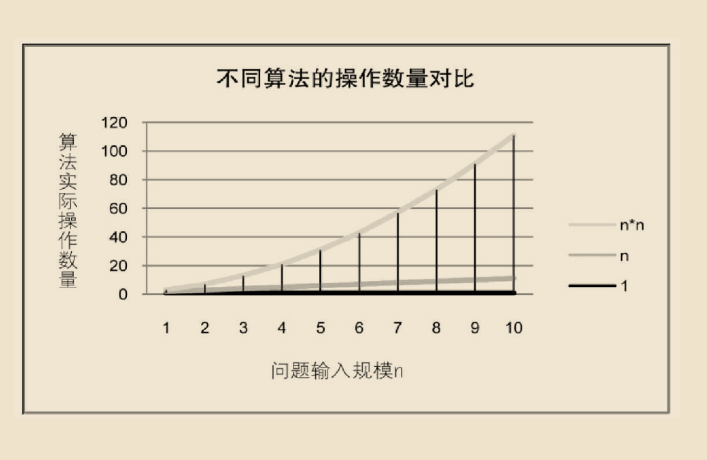

# 算法

算法：


算法是解决特定问题求解步骤的描述，在计算机中表现为指令的有限序列，并且每条指令表示一个或多个操作。

## 数据结构与算法关系

## 算法的定义

什么是算法呢？算法是描述解决问题的方法。

如今普遍认可的对算法的定义是：算法是解决特定问题求解步骤的描述，在计算机中表现为指令的有限序列，并且每条指令表示一个或多个操作。

算法定义中，提到了指令，指令能被人或机器等计算装置执行。它可以是计算机指令，也可以是我们平时的语言文字。


为了解决某个或某类问题，需要把指令表示成一定的操作序列，操作序列包括一组操作，每一个操作都完成特定的功能，这就是算法了。

## 算法的特性

算法具有五个基本特性：输入、输出、有穷性、确定性和可行性。

### 输入输出

输入和输出特性比较容易理解，算法具有零个或多个输入。尽管对于绝大多数算法来说，输入参数都是必要的，但对于个别情况，如打印“helloworld！”这样的代码，不需要任何输入参数，因此算法的输入可以是零个。算法至少有一个或多个输出，算法是一定需要输出的。不需要输出，你用这个算法干吗？输出的形式可以是打印输出，也可以是返回一个或多个值等。

### 有穷性

有穷性：指算法在执行有限的步骤之后，自动结束而不会出现无限循环，并且每一个步骤在可接受的时间内完成。现实中经常会写出死循环的代码，这就是不满足有穷性。当然这里有穷的概念并不是纯数学意义的，而是在实际应用当中合理的、可以接受的“有边界”。你说你写一个算法，计算机需要算上个二十年，一定会结束，它在数学意义上是有穷了，可是媳妇都熬成婆了，算法的意义也不就大了。

### 确定性

确定性：算法的每一步骤都具有确定的含义，不会出现二义性。算法在一定条件下，只有一条执行路径，相同的输入只能有唯一的输出结果。算法的每个步骤被精确定义而无歧义。

### 可行性

可行性：算法的每一步都必须是可行的，也就是说，每一步都能够通过执行有限次数完成。可行性意味着算法可以转换为程序上机运行，并得到正确的结果。尽管在目前计算机界也存在那种没有实现的极为复杂的算法，不是说理论上不能实现，而是因为过于复杂，我们当前的编程方法、工具和大脑限制了这个工作，不过这都是理论研究领域的问题，不属于我们现在要考虑的范围。

## 算法设计的要求

### 正确性

正确性：算法的正确性是指算法至少应该具有输入、输出和加工处理无歧义性、能正确反映问题的需求、能够得到问题的正确答案。

但是算法的“正确”通常在用法上有很大的差别，大体分为以下四个层次。

    1.算法程序没有语法错误。
    2.算法程序对于合法的输入数据能够产生满足要求的输出结果。 
    3.算法程序对于非法的输入数据能够得出满足规格说明的结果。 
    4.算法程序对于精心选择的，甚至刁难的测试数据都有满足要求的输出结果。

### 可读性

可读性：算法设计的另一目的是为了便于阅读、理解和交流。


### 健壮性

一个好的算法还应该能对输入数据不合法的情况做合适的处理。比如输入的时间或者距离不应该是负数等。


健壮性：当输入数据不合法时，算法也能做出相关处理，而不是产生异常或莫名其妙的结果。

### 时间效率高和存储量低

时间效率指的是算法的执行时间，对于同一个问题，如果有多个算法能够解决，执行时间短的算法效率高，执行时间长的效率低。存储量需求指的是算法在执行过程中需要的最大存储空间，主要指算法程序运行时所占用的内存或外部硬盘存储空间。设计算法应该尽量满足时间效率高和存储量低的需求。在生活中，人们都希望花最少的钱，用最短的时间，办最大的事，算法也是一样的思想，最好用最少的存储空间，花最少的时间，办成同样的事就是好的算法。


综上，好的算法，应该具有正确性、可读性、健壮性、高效率和低存储量的特征。


## 算法效率的度量方法

### 事后统计方法

事后统计方法：这种方法主要是通过设计好的测试程序和数据，利用计算机计时器对不同算法编制的程序的运行时间进行比较，从而确定算法效率的高低。

但这种方法显然是有很大缺陷的：

 - 必须依据算法事先编制好程序，这通常需要花费大量的时间和精力。如果编制出来发现它根本是很糟糕的算法，不是竹篮打水一场空吗？

 - 时间的比较依赖计算机硬件和软件等环境因素，有时会掩盖算法本身的优劣。要知道，现在的一台四核处理器的计算机，跟当年286、386、486等老爷爷辈的机器相比，在处理算法的运算速度上，是不能相提并论的；而所用的操作系统、编译器、运行框架等软件的不同，也可以影响它们的结果；就算是同一台机器，CPU使用率和内存占用情况不一样，也会造成细微的差异。

 - 算法的测试数据设计困难，并且程序的运行时间往往还与测试数据“的规模有很大关系，效率高的算法在小的测试数据面前往往得不到体现。比如10个数字的排序，不管用什么算法，差异几乎是零。而如果有一百万个随机数字排序，那不同算法的差异就非常大了。那么我们为了比较算法，到底用多少数据来测试，这是很难判断的问题。

 ### 事前分析估算方法

我们的计算机前辈们，为了对算法的评判更科学，研究出了一种叫做事前分析估算的方法。


事前分析估算方法：在计算机程序编制前，依据统计方法对算法进行估算。

经过分析，我们发现，一个用高级程序语言编写的程序在计算机上运行时所消耗的时间取决于下列因素： 

1.算法采用的策略、方法。 
2.编译产生的代码质量。 
3.问题的输入规模。 
4.机器执行指令的速度。


第1条当然是算法好坏的根本，第2条要由软件来支持，第4条要看硬件性能。也就是说，抛开这些与计算机硬件、软件有关的因素，一个程序的运行时间，依赖于算法的好坏和问题的输入规模。所谓问题输入规模是指输入量的多少。

我们在分析一个算法的运行时间时，重要的是把基本操作的数量与输入规模关联起来，即基本操作的数量必须表示成输入规模的函数（如图2-7-1所示）。



### 函数的渐近增长

我们给出这样的定义，输入规模n在没有限制的情况下，只要超过一个数值N，这个函数就总是大于另一个函数，我们称函数是渐近增长的。


函数的渐近增长：给定两个函数f(n)和g(n)，如果存在一个整数N，使得对于所有的n>N，f(n)总是比g(n)大，那么，我们说f(n)的增长渐近快于g(n)。

判断一个算法的效率时，函数中的常数和其他次要项常常可以忽略，而更应该关注主项（最高阶项）的阶数。

判断一个算法好不好，我们只通过少量的数据是不能做出准确判断的。但如果我们可以对比这几个算法的关键执行次数函数的渐近增长性，基本就可以分析出：**某个算法，随着n的增大，它会越来越优于另一算法，或者越来越差于另一算法。这其实就是事前估算方法的理论依据，通过算法时间复杂度来估算算法时间效率。**

### 算法时间复杂度

#### 算法时间复杂度定义

在进行算法分析时，语句总的执行次数T(n)是关于问题规模n的函数，进而分析T(n)随n的变化情况并确定T(n)的数量级。算法的时间复杂度，也就是算法的时间量度，记作：T(n)=O(f(n))。它表示随问题规模n的增大，算法执行时间的增长率和f(n)的增长率相同，称作算法的渐近时间复杂度，简称为时间复杂度。其中f(n)是问题规模n的某个函数。

这样用大写O( )来体现算法时间复杂度的记法，我们称之为大O记法。

显然，由此算法时间复杂度的定义可知，我们的三个求和算法的时间复杂度分别为O(n)，O(1)，O(n^2)。我们分别给它们取了非官方的名称, “O(1)叫常数阶、O(n)叫线性阶、O(n^2)叫平方阶。


#### 推导大O阶方法

那么如何分析一个算法的时间复杂度呢？即如何推导大O阶呢？我们给出了下面的推导方法，基本上，这也就是总结前面我们举的例子。


**推导大O阶：**


1．用常数1取代运行时间中的所有加法常数。


2．在修改后的运行次数函数中，只保留最高阶项。


3．如果最高阶项存在且不是1，则去除与这个项相乘的常数。


得到的结果就是大O阶。

**常数阶**

首先顺序结构的时间复杂度。下面这个算法，也就是刚才的第二种算法（高斯算法），为什么时间复杂度不是O(3)，而是O(1)。

```
“int sum = 0,n = 100;      /* 执行一次 */

sum = (1 + n) * n / 2;    /* 执行一次 */

printf("%d", sum);        /* 执行一次 */”

```

```
int sum = 0, n = 100;     /* 执行1次 */

sum = (1 + n) * n / 2;    /* 执行第1次 */

sum = (1 + n) * n / 2;    /* 执行第2次 */

sum = (1 + n) * n / 2;    /* 执行第3次 */”

“sum = (1 + n) * n / 2;    /* 执行第4次 */

sum = (1 + n) * n / 2;    /* 执行第5次 */

sum = (1 + n) * n / 2;    /* 执行第6次 */

sum = (1 + n) * n / 2;    /* 执行第7次 */

sum = (1 + n) * n / 2;    /* 执行第8次 */

sum = (1 + n) * n / 2;    /* 执行第9次 */

sum = (1 + n) * n / 2;    /* 执行第10次 */

printf("%d", sum);        /* 执行1次 */”


```

事实上无论n为多少，上面的两段代码就是3次和12次执行的差异。这种与问题的大小无关（n的多少），执行时间恒定的算法，我们称之为具有O(1)的时间复杂度，又叫常数阶。

**线性阶**

线性阶的循环结构会复杂很多。要确定某个算法的阶次，我们常常需要确定某个特定语句或某个语句集运行的次数, 因此，我们要分析算法的复杂度，关键就是要分析循环结构的运行情况。

下面这段代码，它的循环的时间复杂度为O(n)，因为循环体中的代码须要执行n次。

```
int i;

for (i = 0; i < n; i++)

{

    /* 时间复杂度为O(1)的程序步骤序列 */

}
```

**对数阶**

下面的这段代码，时间复杂度又是多少呢？

```
int count = 1;

while (count < n)

{

    count = count * 2;

    /* 时间复杂度为O(1)的程序步骤序列 */

}

```

由于每次count乘以2之后，就距离n更近了一分。也就是说，有多少个2相乘后大于n，则会退出循环。由2^x=n得到x=log2n。所以这个循环的时间复杂度为O(logn)。

**平方阶**

下面例子是一个循环嵌套，它的内循环刚才我们已经分析过，时间复杂度为O(n)

```
int i, j;
for (i = 0; i < n; i++)

{

    for (j = 0; j < n; j++)

    {

        /* 时间复杂度为O(1)的程序步骤序列 */

    }

}
```

“而对于外层的循环，不过是内部这个时间复杂度为O(n)的语句，再循环n次。所以这段代码的时间复杂度为O(n^2)。

如果外循环的循环次数改为了m，时间复杂度就变为O(m×n)。

```
int i, j;

for (i = 0; i < m; i++)

{

    for (j = 0; j < n; j++)

    { /* 时间复杂度为O(1)的程序步骤序列 */

    }

}
```

所以我们可以总结得出，循环的时间复杂度等于循环体的复杂度乘以该循环运行的次数。

#### 常见的时间复杂度

常用的时间复杂度所耗费的时间从小到大依次是：
```
O(1)<O(logn)<O(n)<O(nlogn)<O(n^2)<O(n^3)<O(2^n)<O(n!)<O(n^n)
```

#### 最坏情况与平均情况

对算法的分析，一种方法是计算所有情况的平均值，这种时间复杂度的计算方法称为平均时间复杂度。另一种方法是计算最坏情况下的时间复杂度，这种方法称为最坏时间复杂度。一般在没有特殊说明的情况下，都是指最坏时间复杂度。

#### 算法空间复杂度

算法的空间复杂度通过计算算法所需的存储空间实现，算法空间复杂度的计算公式记作：S(n)=O(f(n))，其中，n为问题的规模，f(n)为语句关于n所占存储空间的函数。

一般情况下，一个程序在机器上执行时，除了需要存储程序本身的指令、常数、变量和输入数据外，还需要存储对数据操作的存储单元。
