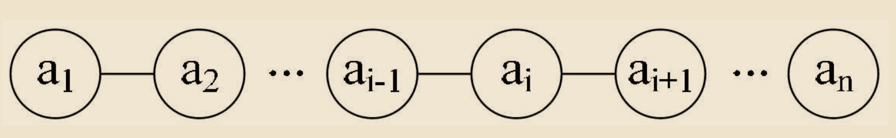
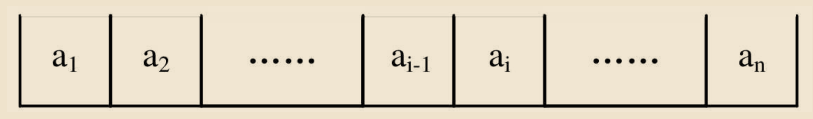
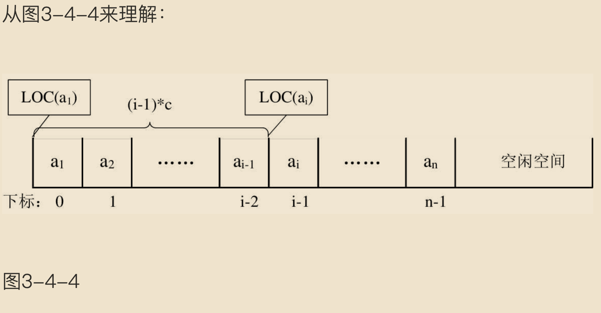
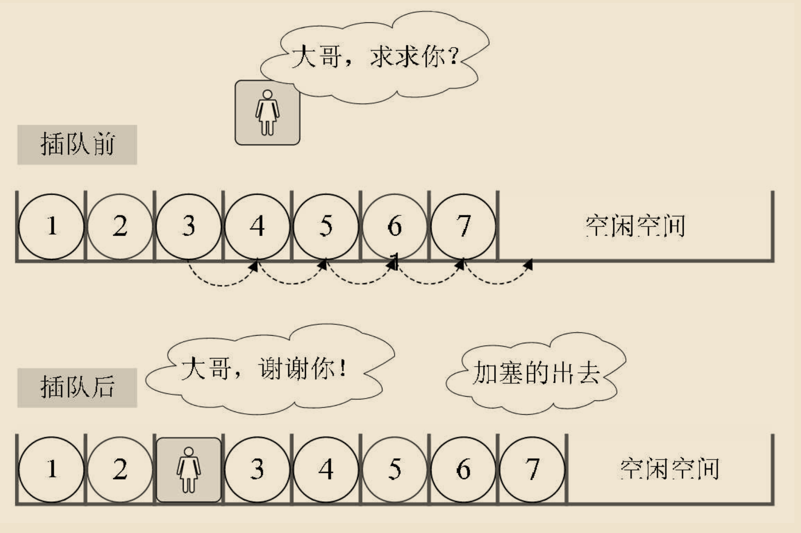

# 线性表

线性表: 零个或多个数据元素的有限序列。

## 线性表的定义

线性表（List）：零个或多个数据元素的有限序列。

这里需要强调几个关键的地方。

- 首先它是一个序列。也就是说，元素之间是有顺序的，若元素存在多个，则第一个元素无前驱，最后一个元素无后继，其他每个元素都有且只有一个前驱和后继。

- 然后，线性表强调是有限的。

如果用数学语言来进行定义。可如下：

若将线性表记为（a<sub>1</sub>，…，a<sub>i-1</sub>，a<sub>i</sub>，a<sub>i+1</sub>，…，a<sub>n</sub>），则表中a<sub>i-1</sub>领先于a<sub>i</sub>，a<sub>i+1</sub>领先于a<sub>i</sub>，称a<sub>i-1</sub>是a<sub>i</sub>的直接前驱元素，a<sub>i+1</sub>是a<sub>i</sub>的直接后继元素。当i=1，2，…，n-1时，a<sub>i</sub>有且仅有一个直接后继，当i=2，3，…，n时，a<sub>i</sub>有且仅有一个直接前驱。如图3-2-1所示。



所以线性表元素的个数n（n≥0）定义为线性表的长度，当n=0时，称为空表。

在非空表中的每个数据元素都有一个确定的位置，如a<sub>1</sub>是第一个数据元素，a<sub>n</sub>是最后一个数据元素，a<sub>i</sub>是第i个数据元素，称i为数据元素a<sub>i</sub>在线性表中的位序。


## 线性表的抽象数据类型

线性表的抽象数据类型定义如下:

```
ADT 线性表(List)

Data

线性表的数据对象集合为{a1, a2, ..., an}, 每个元素的类型均为DataType。

其中，除第一个元素a1外，每一个元素有且只有一个直接前驱元素，除了最后一个元素an外，每一个元素有且只有一个直接后继元素。数据元素之间的关系是一对一的关系。


Operation

    InitList(*L):          初始化操作，建立一个空的线性表L。

    ListEmpty(L):          若线性表为空，返回true，否则返回false。

    ClearList(*L):         将线性表清空。

    GetElem(L, i, *e):     将线性表L中的第i个位置元素值返回给e。

    LocateElem(L, e):      在线性表L中查找与给定值e相等的元素，如果查找成功，返回该元素在表中序号表示成功；

```

仔细分析一下这个操作，发现我们只要循环集合B中的每个元素，判断当前元素是否存在A中，若不存在，则插入到A中即可。思路应该是很容易想到的。

```
/* 将所有的在线性表Lb中但不在La中的数据元素插入到La中 */

void unionL(List *La, List Lb)
{

    int La_len, Lb_len, i;

    /* 声明与La和Lb相同的数据元素e */

    ElemType e;                             

    /* 求线性表的长度 */

    La_len = ListLength(*La);               

    Lb_len = ListLength(Lb);

    for (i = 1; i <= Lb_len; i++)

    {

        /* 取Lb中第i个数据元素赋给e */

        GetElem(Lb, i, &e);                 

        /* La中不存在和e相同数据元素 */

        if (!LocateElem(*La, e))            

            /* 插入 */

            ListInsert(La, ++La_len, e);  
  }

}
```

这里，我们对于union操作，用到了前面线性表基本操作ListLength、GetElem、LocateElem、ListInsert等，可见，对于复杂的个性化的操作，其实就是把基本操作组合起来实现的。

## 线性表的顺序存储结构

### 顺序存储定义

线性表的顺序存储结构，指的是用一段地址连续的存储单元依次存储线性表的数据元素。

线性表（a<sub>1</sub>，…，a<sub>i-1</sub>，a<sub>i</sub>，a<sub>i+1</sub>，…，a<sub>n</sub>）的顺序存储示意图如下：



### 顺序存储方式

线性表的顺序存储结构，就是在内存中找了块地儿，通过占位的形式，把一定内存空间给占了，然后把相同数据类型的数据元素依次存放在这块空地中。既然线性表的每个数据元素的类型都相同，所以可以用C语言（其他语言也相同）的一维数组来实现顺序存储结构，即把第一个数据元素存到数组下标为0的位置中，接着把线性表相邻的元素存储在数组中相邻的位置。

线性表的顺序存储的结构代码。

```
/* 存储空间初始分配量 */

#define MAXSIZE 20             

/* ElemType类型根据实际情况而定，这里假设为int */

typedef int ElemType;          

typedef struct

{

    /* 数组存储数据元素，最大值为MAXSIZE */

    ElemType data[MAXSIZE];    

    /* 线性表当前长度 */
    int length;                

} SqList;
```
这里，我们就发现描述顺序存储结构需要三个属性：


- 存储空间的起始位置：数组data，它的存储位置就是存储空间的存储位置。

- 线性表的最大存储容量：数组长度MaxSize。

- 线性表的当前长度：length。


### 数组长度与线性表长度区别

注意哦，这里有两个概念“数组的长度”和“线性表的长度”需要区分一下。
数组的长度是存放线性表的存储空间的长度，存储分配后这个量一般是不变的。有个别同学可能会问，数组的大小一定不可以变吗？我怎么看到有书中谈到可以动态分配的一维数组。是的，一般高级语言，比如C、VB、C++都可以用编程手段实现动态分配数组，不过这会带来性能上的损耗。


线性表的长度是线性表中数据元素的个数，随着线性表插入和删除操作的进行，这个量是变化的。


在任意时刻，线性表的长度应该小于等于数组的长度。


### 地址计算方法

由于我们数数都是从1开始数的，线性表的定义也不能免俗，起始也是1，可C语言中的数组却是从0开始第一个下标的，于是线性表的第i个元素是要存储在数组下标为i-1的位置，即数据元素的序号和存放它的数组下标之间存在对应关系（如图3-4-3所示）。


用数组存储顺序表意味着要分配固定长度的数组空间，由于线性表中可以进行插入和删除操作，因此分配的数组空间要大于等于当前线性表的长度。

其实，内存中的地址，就和图书馆或电影院里的座位一样，都是有编号的。存储器中的每个存储单元都有自己的编号，这个编号称为地址。

由于每个数据元素，不管它是整型、实型还是字符型，它都是需要占用一定的存储单元空间的。假设占用的是c个存储单元，那么线性表中第i+1个数据元素的存储位置和第i个数据元素的存储位置满足下列关系（LOC表示获得存储位置的函数）。

```
LOC(ai+1)=LOC(ai)+c 
```

所以对于第i个数据元素ai的存储位置可以由a1推算得出：

```
LOC(ai)=LOC(a1)+(i-1)*c
```



通过这个公式，你可以随时算出线性表中任意位置的地址，不管它是第一个还是最后一个，都是相同的时间。那么我们对每个线性表位置的存入或者取出数据，对于计算机来说都是相等的时间，也就是一个常数，因此用我们算法中学到的时间复杂度的概念来说，它的存取时间性能为O(1)。我们通常把具有这一特点的存储结构称为随机存取结构。

## 顺序存储结构的插入与删除

### 获得元素操作

对于线性表的顺序存储结构来说，如果我们要实现GetElem操作，即将线性表L中的第i个位置元素值返回，其实是非常简单的。就程序而言，只要i的数值在数组下标范围内，就是把数组第i-1下标的值返回即可。来看代码：

```
#define OK 1

#define ERROR 0

#define TRUE 1

#define FALSE 0

typedef int Status;

/* Status是函数的类型，其值是函数结果状态代码，如OK等 */
/* 初始条件：顺序线性表L已存在，1≤i≤ListLength(L) */
/* 操作结果：用e返回L中第i个数据元素的值 */

Status GetElem(SqList L, int i, ElemType *e) {
    if (L.length == 0 || i < 1 || i > L.length) {
        return ERROR;
    }
    *e = L -> data[i - 1];
    return OK;
}

```

注意这里返回值类型Status是一个整型，返回OK代表1，ERROR代表0。之后代码中出现就不再详述。

### 插入操作



插入算法的思路：

- 如果插入位置不合理，抛出异常；


- 如果线性表长度大于等于数组长度，则抛出异常或动态增加容量；


- 从最后一个元素开始向前遍历到第i个位置，分别将它们都向后移动一个位置；


- 将要插入元素填入位置i处； ?表长加1。

实现代码如下:

```
/* 初始条件：顺序线性表L已存在，1≤i≤ListLength(L)， */

Insert(Sqlist *L, i, ElemType e) {
    if (i < 1 || i > L.length) {
        return ERROR;
    }
    for (int j = L.length - 1; j > i - 1; j--) {
        L.data[j + 1] = L.data[j];
    }
}
```