# 线性表

线性表: 零个或多个数据元素的有限序列。

## 线性表的定义

线性表（List）：零个或多个数据元素的有限序列。

这里需要强调几个关键的地方。

- 首先它是一个序列。也就是说，元素之间是有顺序的，若元素存在多个，则第一个元素无前驱，最后一个元素无后继，其他每个元素都有且只有一个前驱和后继。

- 然后，线性表强调是有限的。

如果用数学语言来进行定义。可如下：

若将线性表记为（a<sub>1</sub>，…，a<sub>i-1</sub>，a<sub>i</sub>，a<sub>i+1</sub>，…，a<sub>n</sub>），则表中a<sub>i-1</sub>领先于a<sub>i</sub>，a<sub>i+1</sub>领先于a<sub>i</sub>，称a<sub>i-1</sub>是a<sub>i</sub>的直接前驱元素，a<sub>i+1</sub>是a<sub>i</sub>的直接后继元素。当i=1，2，…，n-1时，a<sub>i</sub>有且仅有一个直接后继，当i=2，3，…，n时，a<sub>i</sub>有且仅有一个直接前驱。如图3-2-1所示。


所以线性表元素的个数n（n≥0）定义为线性表的长度，当n=0时，称为空表。

在非空表中的每个数据元素都有一个确定的位置，如a<sub>1</sub>是第一个数据元素，a<sub>n</sub>是最后一个数据元素，a<sub>i</sub>是第i个数据元素，称i为数据元素a<sub>i</sub>在线性表中的位序。


## 线性表的抽象数据类型

线性表的抽象数据类型定义如下:

```
ADT 线性表(List)

Data

线性表的数据对象集合为{a1, a2, ..., an}, 每个元素的类型均为DataType。

其中，除第一个元素a1外，每一个元素有且只有一个直接前驱元素，除了最后一个元素an外，每一个元素有且只有一个直接后继元素。数据元素之间的关系是一对一的关系。


Operation

    InitList(*L):          初始化操作，建立一个空的线性表L。

    ListEmpty(L):          若线性表为空，返回true，否则返回false。

    ClearList(*L):         将线性表清空。

    GetElem(L, i, *e):     将线性表L中的第i个位置元素值返回给e。

    LocateElem(L, e):      在线性表L中查找与给定值e相等的元素，如果查找成功，返回该元素在表中序号表示成功；

```

仔细分析一下这个操作，发现我们只要循环集合B中的每个元素，判断当前元素是否存在A中，若不存在，则插入到A中即可。思路应该是很容易想到的。

```
/* 将所有的在线性表Lb中但不在La中的数据元素插入到La中 */

void unionL(List *La, List Lb)
{

    int La_len, Lb_len, i;

    /* 声明与La和Lb相同的数据元素e */

    ElemType e;                             

    /* 求线性表的长度 */

    La_len = ListLength(*La);               

    Lb_len = ListLength(Lb);

    for (i = 1; i <= Lb_len; i++)

    {

        /* 取Lb中第i个数据元素赋给e */

        GetElem(Lb, i, &e);                 

        /* La中不存在和e相同数据元素 */

        if (!LocateElem(*La, e))            

            /* 插入 */

            ListInsert(La, ++La_len, e);  
  }

}
```

这里，我们对于union操作，用到了前面线性表基本操作ListLength、GetElem、LocateElem、ListInsert等，可见，对于复杂的个性化的操作，其实就是把基本操作组合起来实现的。

## 线性表的顺序存储结构

### 顺序存储定义

线性表的顺序存储结构，指的是用一段地址连续的存储单元依次存储线性表的数据元素。

线性表（a<sub>1</sub>，…，a<sub>i-1</sub>，a<sub>i</sub>，a<sub>i+1</sub>，…，a<sub>n</sub>）的顺序存储示意图如下：


### 顺序存储方式

线性表的顺序存储结构，就是在内存中找了块地儿，通过占位的形式，把一定内存空间给占了，然后把相同数据类型的数据元素依次存放在这块空地中。既然线性表的每个数据元素的类型都相同，所以可以用C语言（其他语言也相同）的一维数组来实现顺序存储结构，即把第一个数据元素存到数组下标为0的位置中，接着把线性表相邻的元素存储在数组中相邻的位置。

线性表的顺序存储的结构代码。

```
/* 存储空间初始分配量 */

#define MAXSIZE 20             

/* ElemType类型根据实际情况而定，这里假设为int */

typedef int ElemType;          

typedef struct

{

    /* 数组存储数据元素，最大值为MAXSIZE */

    ElemType data[MAXSIZE];    

    /* 线性表当前长度 */
    int length;                

} SqList;
```
这里，我们就发现描述顺序存储结构需要三个属性：


- 存储空间的起始位置：数组data，它的存储位置就是存储空间的存储位置。

- 线性表的最大存储容量：数组长度MaxSize。

- 线性表的当前长度：length。


### 数组长度与线性表长度区别

注意哦，这里有两个概念“数组的长度”和“线性表的长度”需要区分一下。
数组的长度是存放线性表的存储空间的长度，存储分配后这个量一般是不变的。有个别同学可能会问，数组的大小一定不可以变吗？我怎么看到有书中谈到可以动态分配的一维数组。是的，一般高级语言，比如C、VB、C++都可以用编程手段实现动态分配数组，不过这会带来性能上的损耗。


线性表的长度是线性表中数据元素的个数，随着线性表插入和删除操作的进行，这个量是变化的。


在任意时刻，线性表的长度应该小于等于数组的长度。


### 地址计算方法

由于我们数数都是从1开始数的，线性表的定义也不能免俗，起始也是1，可C语言中的数组却是从0开始第一个下标的，于是线性表的第i个元素是要存储在数组下标为i-1的位置，即数据元素的序号和存放它的数组下标之间存在对应关系（如图3-4-3所示）。


用数组存储顺序表意味着要分配固定长度的数组空间，由于线性表中可以进行插入和删除操作，因此分配的数组空间要大于等于当前线性表的长度。

其实，内存中的地址，就和图书馆或电影院里的座位一样，都是有编号的。存储器中的每个存储单元都有自己的编号，这个编号称为地址。

由于每个数据元素，不管它是整型、实型还是字符型，它都是需要占用一定的存储单元空间的。假设占用的是c个存储单元，那么线性表中第i+1个数据元素的存储位置和第i个数据元素的存储位置满足下列关系（LOC表示获得存储位置的函数）。

```
LOC(ai+1)=LOC(ai)+c 
```

所以对于第i个数据元素ai的存储位置可以由a1推算得出：

```
LOC(ai)=LOC(a1)+(i-1)*c
```


通过这个公式，你可以随时算出线性表中任意位置的地址，不管它是第一个还是最后一个，都是相同的时间。那么我们对每个线性表位置的存入或者取出数据，对于计算机来说都是相等的时间，也就是一个常数，因此用我们算法中学到的时间复杂度的概念来说，它的存取时间性能为O(1)。我们通常把具有这一特点的存储结构称为随机存取结构。

## 顺序存储结构的插入与删除

### 获得元素操作

对于线性表的顺序存储结构来说，如果我们要实现GetElem操作，即将线性表L中的第i个位置元素值返回，其实是非常简单的。就程序而言，只要i的数值在数组下标范围内，就是把数组第i-1下标的值返回即可。来看代码：

```
#define OK 1

#define ERROR 0

#define TRUE 1

#define FALSE 0

typedef int Status;

/* Status是函数的类型，其值是函数结果状态代码，如OK等 */
/* 初始条件：顺序线性表L已存在，1≤i≤ListLength(L) */
/* 操作结果：用e返回L中第i个数据元素的值 */

Status GetElem(SqList L, int i, ElemType *e) {
    if (L.length == 0 || i < 1 || i > L.length) {
        return ERROR;
    }
    *e = L -> data[i - 1];
    return OK;
}

```

注意这里返回值类型Status是一个整型，返回OK代表1，ERROR代表0。之后代码中出现就不再详述。

### 插入操作


插入算法的思路：

- 如果插入位置不合理，抛出异常；


- 如果线性表长度大于等于数组长度，则抛出异常或动态增加容量；


- 从最后一个元素开始向前遍历到第i个位置，分别将它们都向后移动一个位置；


- 将要插入元素填入位置i处； ?表长加1。

实现代码如下:

```
/* 初始条件：顺序线性表L已存在，1≤i≤ListLength(L)， */

Status Insert(Sqlist *L, i, ElemType e) {
    if (L -> length == MAXSIZE) {
        return ERROR;
    }
    if (i < 1 || i > L -> length + 1) {
        return ERROR;
    }
    if (i <= L -> length) {
        for (int j = L -> length - 1; j >= i - 1; j--) {
            L -> data[j + 1] = L -> data[j];
        }
    }
    L -> data[i-1] = e;
    L -> length++;
    return OK;
}
```

### 删除操作

删除算法的思路：

- 如果删除位置不合理，抛出异常；
- 取出删除元素；
- 从删除元素位置开始遍历到最后一个元素位置，分别将它们都向前移动一个位置；
- 表长减1。

实现代码如下：

```
/* 初始条件：顺序线性表L已存在，1≤i≤ListLength(L)， */
Status Delete(Sqlist *L, int i, ElemType *e) {
    if (L -> length == 0 || i < 1 || i > L -> length) {
        return ERROR;
    }
    *e = L -> data[i-1];
    if (i < L -> length) {
        for (int j = i + 1; j <= L -> length; j++) {
            L -> data[j - 2] = L -> data[j - 1];
        }
    }
    
    L -> length--;
    return OK;
}

```

线性表的顺序存储结构，在存、读数据时，不管是哪个位置，时间复杂度都是O(1)；而插入或删除时，时间复杂度都是O(n)。

### 线性表顺序存储结构的优缺点

| 优点 | 缺点 |
| --- | --- |
| 无须次表示表中元素之间的逻辑关系而增加额外的存储空间   |  插入和删除操作需要移动大量元素 |     
| 可以快速地存取表中任一位置的元素   |  当线性表长度变化较大时，难以确定存储空间的容量   |
|  | “造成存储空间的“碎片” |

## 线性表的链式存储结构

### 顺序存储结构不足的解决办法

线性表的顺序存储结构。它是有缺点的，最大的缺点就是插入和删除时需要移动大量元素，这显然就需要耗费时间。能不能想办法解决呢？

要解决这个问题，我们就得考虑一下导致这个问题的原因。


为什么当插入和删除时，就要移动大量元素，仔细分析后，发现原因就在于相邻两元素的存储位置也具有邻居关系。它们编号是1，2，3，…，n，它们在内存中的位置也是挨着的，中间没有空隙，无法快速介入，而删除后，当中就会留出空隙，自然需要弥补。问题就出在这里。


### 线性表链式存储结构定义

线性表的链式存储结构的特点是用一组任意的存储单元存储线性表的数据元素，这组存储单元可以是连续的，也可以是不连续的。这就意味着，这些数据元素可以存在内存未被占用的任意位置。

以前在顺序结构中，每个数据元素只需要存数据元素信息就可以了。现在链式结构中，除了要存数据元素信息外，还要存储它的后继元素的存储地址。

因此，为了表示每个数据元素ai与其直接后继数据元素ai+1之间的逻辑关系,
对数据元素ai来说，除了存储其本身的信息之外，还需存储一个指示其直接后继的信息（即直接后继的存储位置）。

- 我们把存储数据元素信息的域称为数据域，
- 把存储直接后继位置的域称为指针域。指针域中存储的信息称做指针或链。
- 这两部分信息组成数据元素ai的存储映像，称为结点（Node）。

n个结点(ai的存储映像)链结成一个链表，即为线性表(a1, a2, ..., an)的链式存储结构，因为此链表的每个结点中只包含一个指针域，所以叫做单链表。单链表正是通过每个结点的指针域将线性表的数据元素按其逻辑次序链接在一起，如图3-6-2所示。

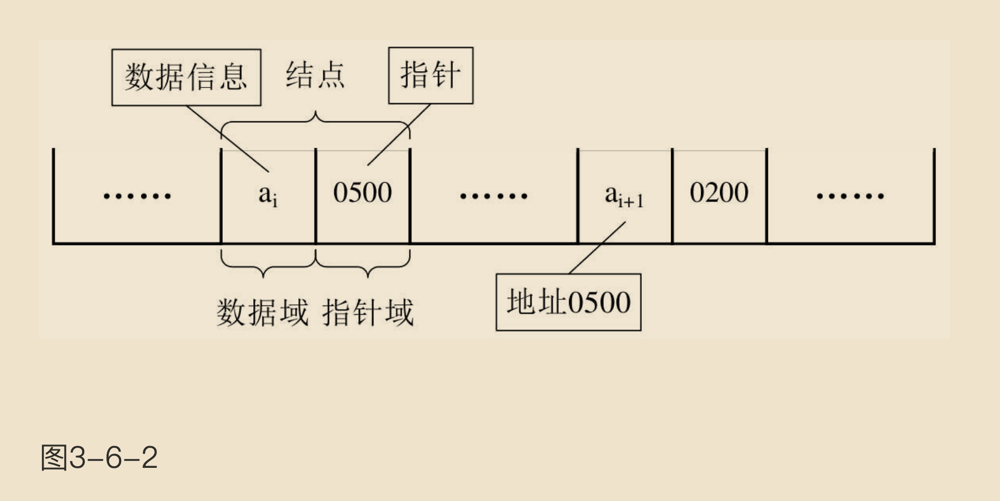

对于线性表来说，总得有个头有个尾，链表也不例外。

- 我们把链表中第一个结点的存储位置叫做头指针，那么整个链表的存取就必须是从头指针开始进行了。
- 之后的每一个结点，其实就是上一个的后继指针指向的位置。
- 想象一下，最后一个结点，它的指针指向哪里？最后一个，当然就意味着直接后继不存在了，所以我们规定，线性链表的最后一个结点指针为“空”（通常用NULL或“^”符号表示，如图3-6-3所示）。

    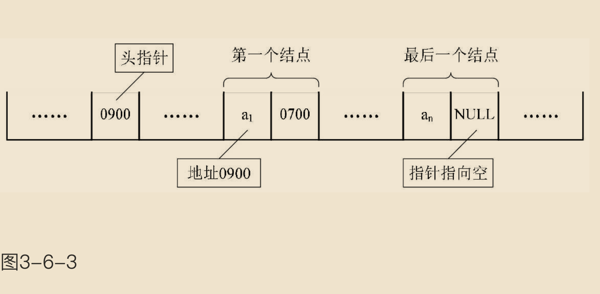

- 有时，我们为了更加方便地对链表进行操作，会在单链表的第一个结点前附设一个结点，称为头结点。头结点的数据域可以不存储任何信息，谁叫它是第一个呢，有这个特权。也可以存储如线性表的长度等附加信息，头结点的指针域存储指向第一个结点的指针，如图3-6-4所示。

    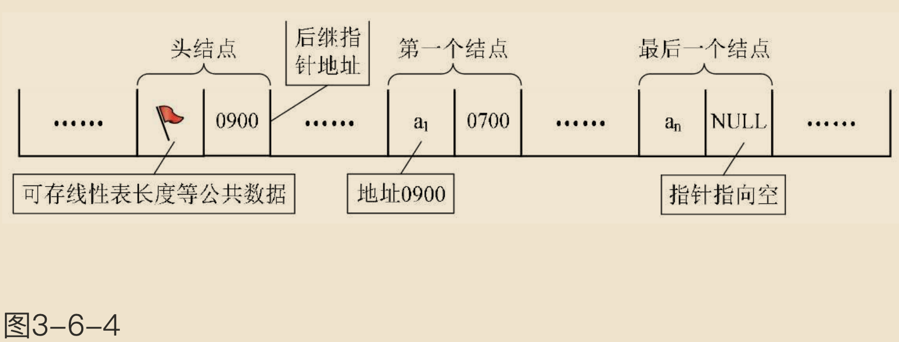


### 头指针与头结点的异同

头指针与头结点的异同点，如图3-6-5所示。

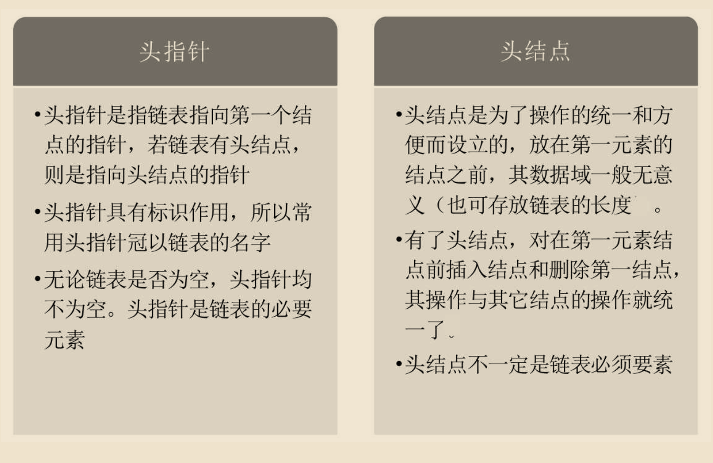

### 线性表链式存储结构代码描述

若线性表为空表，则头结点的指针域为“空”，如图3-6-6所示。

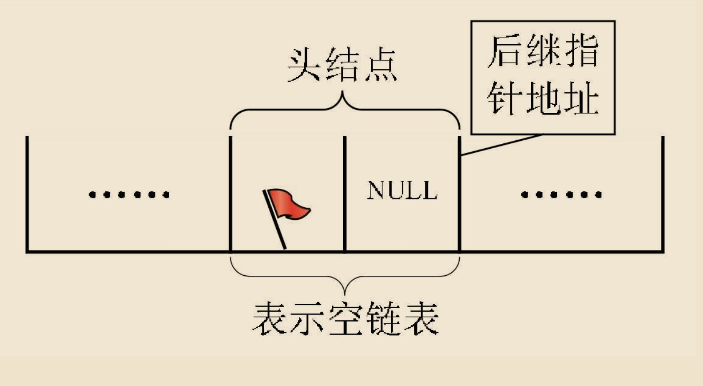

这里我们大概地用图示表达了内存中单链表的存储状态。看着满图的省略号“……”，你就知道是多么不方便。而我们真正关心的：它是在内存中的实际位置吗？不是的，这只是它所表示的线性表中的数据元素及数据元素之间的逻辑关系。所以我们改用更方便的存储示意图来表示单链表，如图3-6-7所示。

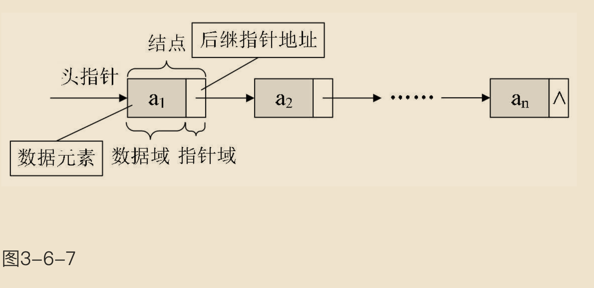

若带有头结点的单链表，则如图3-6-8所示。

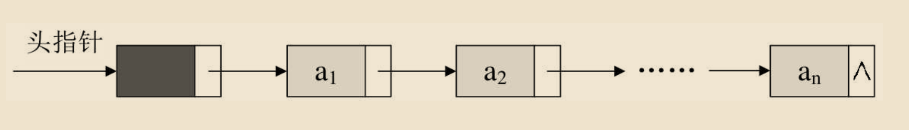

空链表如图3-6-9所示。

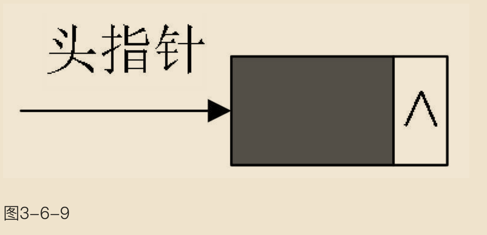


单链表中，我们在C语言中可用结构指针来描述。

```c
// 线性表的单链表存储结构

typedef int ElemType;

typedef struct Node {
    ElemType data;
    struct Node *next;
}Node;

typedef struct Node *LinkList;

```

### 单链表的读取

在线性表的顺序存储结构中，我们要计算任意一个元素的存储位置是很容易的。但在单链表中，由于第i个元素到底在哪？没办法一开始就知道，必须得从头开始找。因此，对于单链表实现获取第i个元素的数据的操作GetElem，在算法上，相对要麻烦一些。

获得链表第i个数据的算法思路：


1.声明一个指针p指向链表第一个结点，初始化j从1开始；


2.当j<i时，就遍历链表，让p的指针向后移动，不断指向下一结点，j累加1；


3.若到链表末尾p为空，则说明第i个结点不存在；


4.否则查找成功，返回结点p的数据。


实现代码算法如下：

```c
// 初始条件：顺序线性表L已存在，1≤i≤ListLength(L)
// 操作结果：用e返回L中第i个数据元素的值

Status GetElem(LinkList *L, int i, ElemType *e) {
    if (i < 1) {
        return ERROR;
    }
    int j = 1;
    // 指向第一个结点, LinkList是(类型为struct Node的)指针类型 
    LinkList p = L->next;
    while (j < i && p) {
        p = p -> next;
        j++;
    }
    // 第i个结点不存在
    if (!p || j > i) {
        return ERROR;
    }
    *e = p -> data;
    return OK;
}

```

### 单链表的插入与删除

#### 单链表的插入

先来看单链表的插入。假设存储元素e的结点为s，要实现结点p、p->next和s之间逻辑关系的变化，只需将结点s插入到结点p和p->next之间即可。可如何插入呢（如图3-8-1所示）？

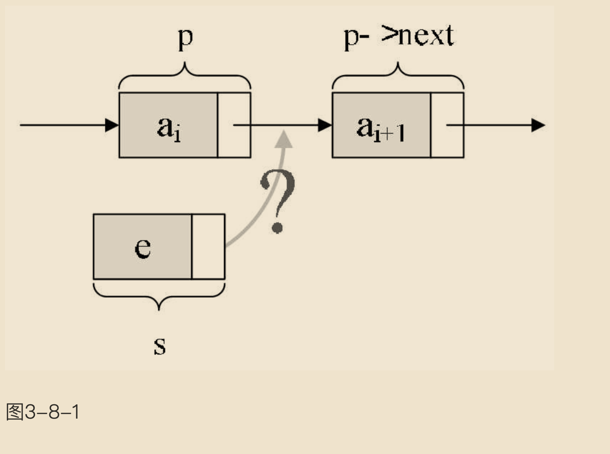

根本用不着惊动其他结点，只需要让s->next和p->next的指针做一点改变即可。

```
s->next = p->next; p->next = s;
```

解读这两句代码，也就是说让p的后继结点改成s的后继结点，再把结点s变成p的后继结点（如图3-8-2所示）。

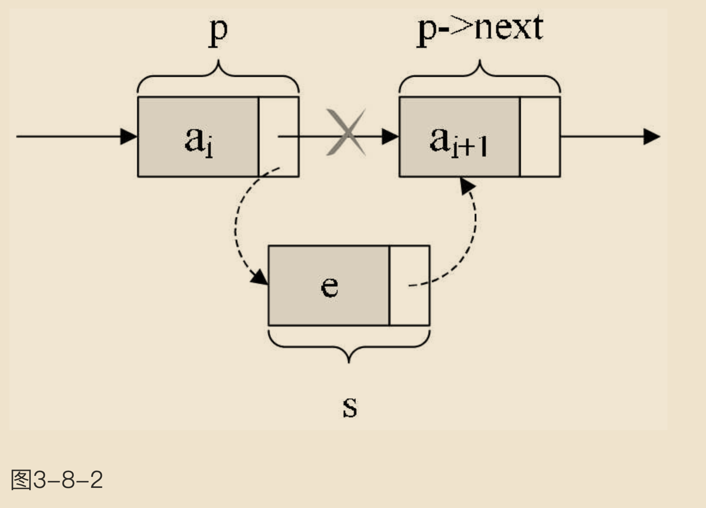

插入结点s后，链表如图3-8-3所示。

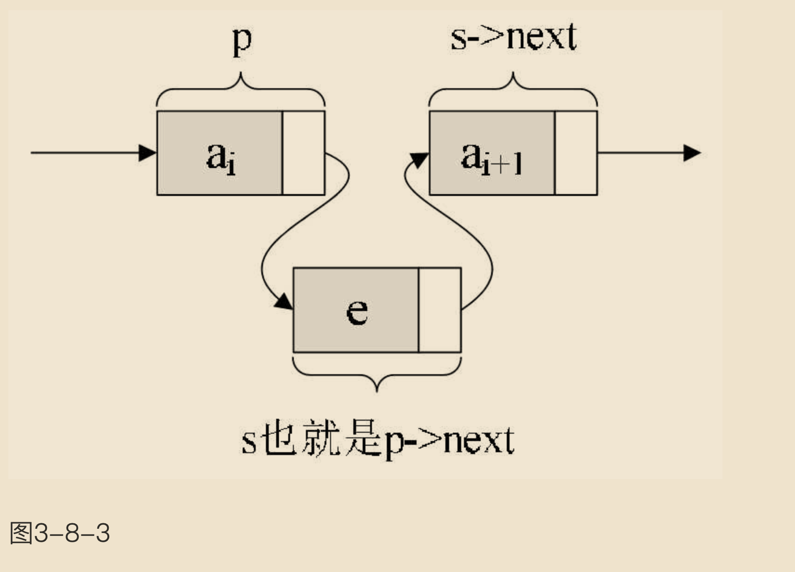

对于单链表的表头和表尾的特殊情况，操作是相同的，如图3-8-4所示。

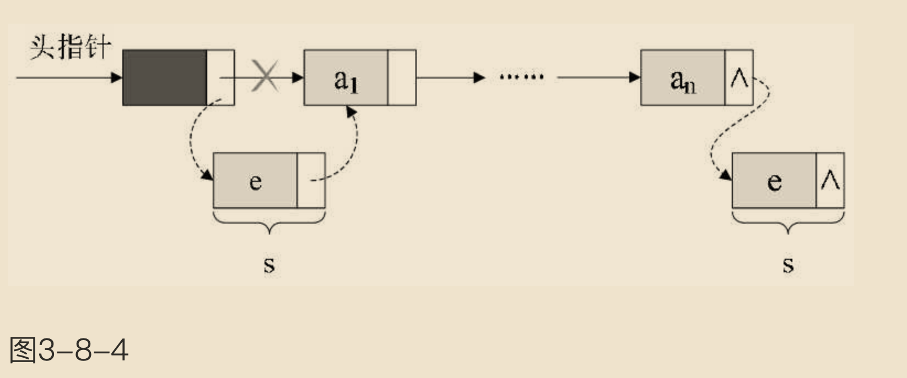

单链表第i个数据插入结点的算法思路： 

1.声明一指针p指向链表头结点，初始化j从1开始； 
2.当j<i时，就遍历链表，让p的指针向后移动，不断指向下一结点，j累加1； 
3.若到链表末尾p为空，则说明第i个结点不存在； 
4.否则查找成功，在系统中生成一个空结点s； 
5.将数据元素e赋值给s->data； 
6.单链表的插入标准语句s->next=p->next;p->next=s； 
7.返回成功。


实现代码算法如下：

```c
Status InsertList(LinkList *L, int i, ElemType e) {
    if (i < 1) {
        return ERROR;
    }
    int j = 1;
    /*
    这里为什么不是用LinkList p = L？
    1. LinkList p = *L;
    这意味着：

    L 是链表头的 指针（即 LinkList *L）。
    *L 解引用这个指针，得到的是 L 所指向的 节点（即链表的头节点）。
    然后，p 是一个指向该节点的 指针，也就是说，p 和 *L 指向的是同一个节点——链表的头节点。
    换句话说：p 是指向链表头节点的指针，就像 L 一样。

    2. LinkList p = L;
    这意味着：

    L 是链表头的 指针（即 LinkList *L）。
    那么 p 就会是一个指向 指针 的指针（因为 LinkList 被定义为 Node *，所以 p 应该是 Node ** 类型）。
    这样的话，p 就会指向 L，也就是指向存储头节点地址的那个指针，而不是指向链表的头节点。
    换句话说：p 会是一个指向 L 的指针，也就是一个指向链表头指针的指针。
    */
    LinkList p = *L;
    while (p && j < i) {
        p = p -> next;
        j++;
    }
    if (!p || j > i) {
        return ERROR;
    }
    LinkList *s = (LinkList)malloc(sizeof(Node));
    s -> data = e;
    s -> next = p -> next;
    p -> next = s;
    return OK;
}
```

#### 单链表的删除

现在我们再来看单链表的删除。设存储元素ai的结点为q，要实现将结点q删除单链表的操作，其实就是将它的前继结点的指针绕过，指向它的后继结点即可，如图3-8-5所示。

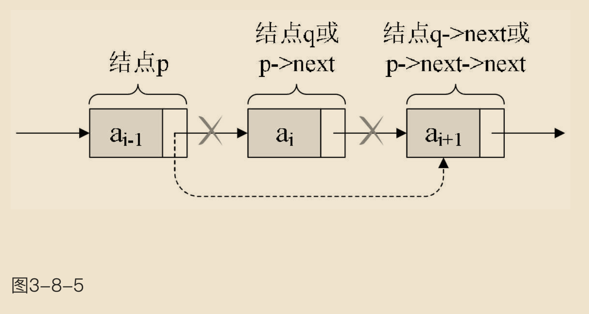

我们所要做的，实际上就是一步，p->next=p->next->next，用q来取代p->next，即是：

```
q=p->next; p->next=q->next;
```

单链表第i个数据删除结点的算法思路：

1.声明一指针p指向链表头结点，初始化j从1开始；

2.当j<i时，就遍历链表，让p的指针向后移动，不断指向下一个结点，j累加1；

3.若到链表末尾p为空，则说明第i个结点不存在；


4.否则查找成功，将欲删除的结点p->next赋值给q；


5.单链表的删除标准语句p->next=q->next；


6.将q结点中的数据赋值给e，作为返回；


7.释放q结点；


8.返回成功。


实现代码算法如下：

```c
Status DeleteList(LinkList *L, int i, ElemType *e) {
    if (i < 1) {
        return ERROR;
    }
    int j = 1;
    LinkList p = *L;
    /*
    这里while的判断是否为空为什么是用p->next而不是p？
    这个循环是想找到删除结点的前一个结点，因为当你删除一个结点时，你需要调整前一个结点的后驱结点
    */
    while (p->next && j < i) {
        p = p -> next;
        j++;
    }
    // 第i个结点不存在
    if (!(p->next) || j > i) {
        return ERROR;
    }
    LinkList q = p -> next;
    p -> next = q -> next;
    *e = q -> data;
    free(q);
    return OK;
}
```

#### 单链表的整表创建

回顾一下，顺序存储结构的创建，其实就是一个数组的初始化，即声明一个类型和大小的数组并赋值的过程。而单链表和顺序存储结构就不一样，它不像顺序存储结构这么集中，它可以很散，是一种动态结构。对于每个链表来说，它所占用空间的大小和位置是不需要预先分配划定的，可以根据系统的情况和实际的需求即时生成。

所以创建单链表的过程就是一个动态生成链表的过程。即从“空表”的初始状态起，依次建立各元素结点，并逐个插入链表。


单链表整表创建的算法思路：


1.声明一指针p和计数器变量i；


2.初始化一空链表L；


3.让L的头结点的指针指向NULL，即建立一个带头结点的单链表；


4.循环：

- 生成一新结点赋值给p；
- 随机生成一数字赋值给p的数据域p->data；
- 将p插入到头结点与前一新结点之间。

实现代码算法如下：

```c
void CreateListHead(LinkList *L, int n) {
    /*
    等式左边为什么是用*L而不是L？
    1. *L = (LinkList)malloc(sizeof(Node));：

    L 是一个指向指针的指针，也就是指向链表头指针的指针。它允许函数直接修改链表的头指针。
    *L 解引用指针 L（也就是访问 L 指向的实际 LinkList），并将 malloc(sizeof(Node)) 分配的内存地址赋值给它。
    这行代码的作用是：为链表的头节点分配内存，并将这个内存地址赋给链表头指针 *L。
    为什么要使用 *L？

    因为 L 是指向头指针的指针，我们需要通过 *L 来修改链表的头指针。修改 *L 直接影响调用函数中的原始头指针。
    这样做是为了确保在调用 CreateLinkList 后，调用者能够获得正确的链表头指针。
    2. L = (LinkList)malloc(sizeof(Node));：

    这行代码会尝试修改函数内部的 局部 L 指针。
    由于 L 是通过值传递给函数的（在 C 语言中，函数参数是按值传递的），修改 L 只是修改了函数内部的局部副本，不会影响到调用函数中的原始头指针。
    因此，这种做法不会修改链表头指针，最终链表的头指针仍然是 NULL，没有创建链表。
    */
    *L = (LinkList)malloc(sizeof(Node));
    /*
    This initializes the random number generator using the current time as the seed (time(0)). This ensures that the random numbers generated are different each time the program runs. It’s necessary because if we don't set the seed, rand() might produce the same sequence of numbers every time the program is run.
    */
    srand(time(0));
    // 建立一个带头结点的单链表
    (*L) -> next = NULL;
    for (int i = 0; i < n; i++) {
        LinkList p = (LinkList)malloc(sizeof(Node));
        // This line assigns a random integer to the data field of the new node. rand() % 100 + 1 generates a random integer between 1 and 100.
        p -> data = rand() % 100 + 1;
        p -> next = (*L) -> next;
        (*L) -> next = p;
    }
}
```

这段算法代码里，我们其实用的是插队的办法，就是始终让新结点在第一的位置。我也可以把这种算法简称为头插法，如图3-9-1所示。

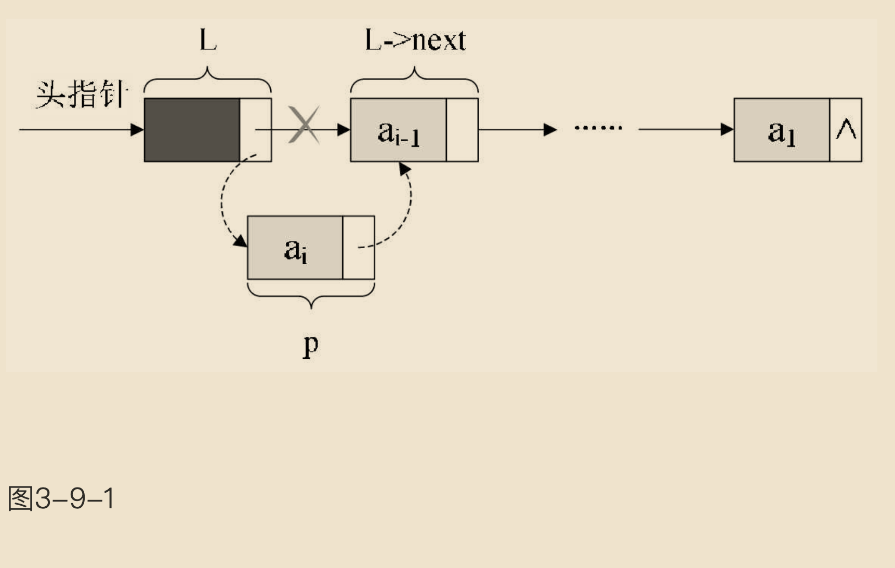

可事实上，我们还是可以不这样干，为什么不把新结点都放到最后呢，这才是排队时的正常思维，所谓的先来后到。我们把每次新结点都插在终端结点的后面，这种算法称之为尾插法。


实现代码算法如下：

```c
void CreateListTail(LinkList *L, int n) {
    *L = (LinkList)malloc(sizeof(Node));
    srand(time(0));
    // tail为指向尾部的结点
    LinkList r = *L;
    for(int i = 0; i < n; i++) {
        LinkList p = (LinkList)malloc(sizeof(Node));
        p -> data = rand() % 100 + 1;
        r -> next = p;
        r = p;
    }
    r -> next = NULL;
}
```

注意L与r的关系，L是指整个单链表，而r是指向尾结点的变量，r会随着循环不断地变化结点，而L则是随着循环增长为一个多结点的链表。

这里需解释一下，r->next=p;的意思，其实就是将刚才的表尾终端结点r的指针指向新结点p，如图3-9-2所示，当中①位置的连线就是表示这个意思。

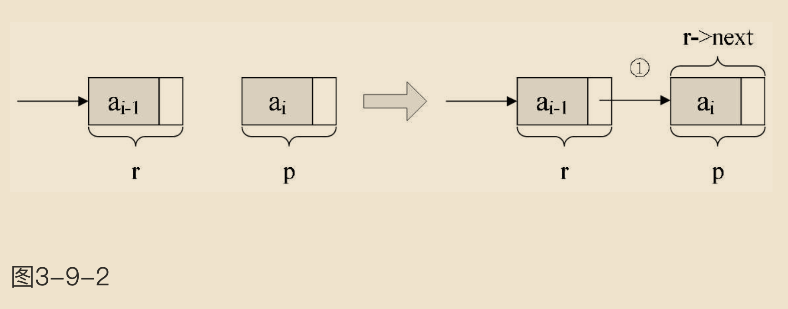

r->next=p;这一句应该还好理解，后面这一句r=p;是什么意思？请看图3-9-3。

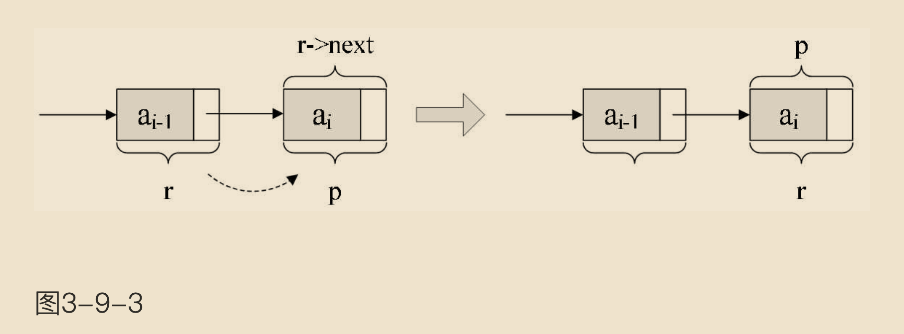

它的意思，就是本来r是在a<sub>i-1</sub>
元素的结点，可现在它已经不是最后的结点了，现在最后的结点是a<sub>i</sub>，所以应该要让将p结点这个最后的结点赋值给r。此时r又是最终的尾结点了。循环结束后，那么应该让这个节点的指针域置空，因此有了“r->next=NULL;”，以便以后遍历时可以确认其是尾部

#### 单链表的整表删除

当我们不打算使用这个单链表时，我们需要把它销毁，其实也就是在内存中将它释放掉，以便于留出空间给其他程序或软件使用。

单链表整表删除的算法思路如下：

1.声明一指针p和q；

2.将第一个结点赋值给p；

3.循环：

- 将下一结点赋值给q；
- 释放p；
- 将q赋值给p。

实现代码算法如下：

```c
Status ClearList(LinkList *L) {
    LinkList p, q;
    p = (*L) -> next;
    // 没到表尾
    while (p) {
        q = p -> next;
        free(p);
        p = q;
    }
    // 头结点指针域为空
    (*L)->next = NULL;    
    return OK;
}
```
这段算法代码里，常见的错误就是有同学会觉得q变量没有存在的必要。在循环体内直接写free(p); p = p->next;即可。可这样会带来什么问题？

要知道p指向一个结点，它除了有数据域，还有指针域。你在做free(p);时，其实是在对它整个结点进行删除和内存释放的工作。
变量q的作用，它使得下一个结点是谁得到了记录，以便于等当前结点释放后，把下一结点拿回来补充。


### 单链表结构与顺序存储结构优缺点

简单地对单链表结构和顺序存储结构做对比：

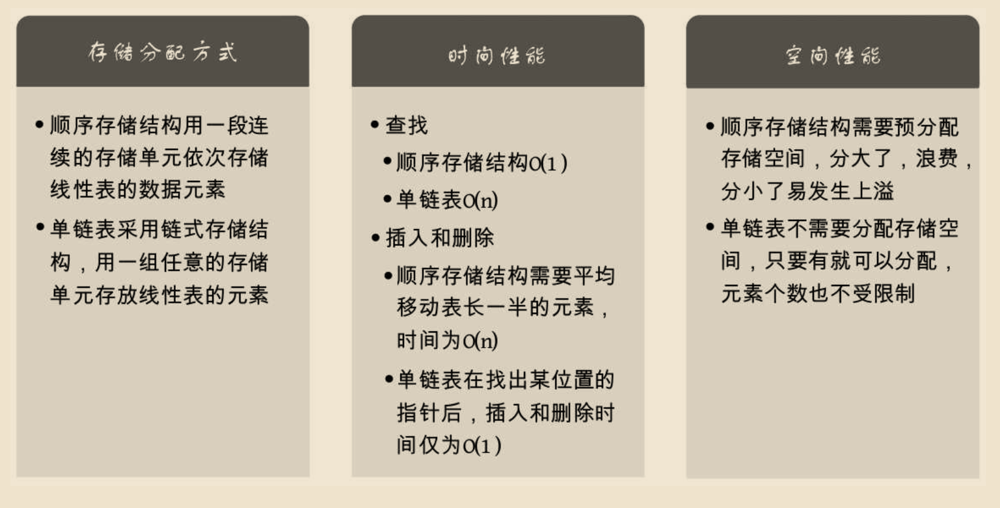

通过上面的对比，我们可以得出一些经验性的结论：

- 若线性表需要频繁查找，很少进行插入和删除操作时，宜采用顺序存储结构。若需要频繁插入和删除时，宜采用单链表结构。比如说游戏开发中，对于用户注册的个人信息，除了注册时插入数据外，绝大多数情况都是读取，所以应该考虑用顺序存储结构。而游戏中的玩家的武器或者装备列表，随着玩家的游戏过程中，可能会随时增加或删除，此时再用顺序存储就不太合适了，单链表结构就可以大展拳脚。当然，这只是简单的类比，现实中的软件开发，要考虑的问题会复杂得多。


- 当线性表中的元素个数变化较大或者根本不知道有多大时，最好用单链表结构，这样可以不需要考虑存储空间的大小问题。而如果事先知道线性表的大致长度，比如一年12个月，一周就是星期一至星期日共七天，这种用顺序存储结构效率会高很多。

总之，线性表的顺序存储结构和单链表结构各有其优缺点，不能简单的说哪个好，哪个不好，需要根据实际情况，来综合平衡采用哪种数据结构更能满足和达到需求和性能。

## 静态链表

其实C语言真是好东西，它具有的指针能力，使得它可以非常容易地操作内存中的地址和数据，这比其他高级语言更加灵活方便。后来的面向对象语言，如Java、C#等，虽不使用指针，但因为启用了对象引用机制，从某种角度也间接实现了指针的某些作用。但对于一些语言，如Basic、Fortran等早期的编程高级语言，由于没有指针，链表结构按照前面我们的讲法，它就没法实现了。怎么办呢？


有人就想出来用数组来代替指针，来描述单链表。真是不得不佩服他们的智慧，我们来看看他是怎么做到的。

“首先我们让数组的元素都是由两个数据域组成，data和cur。也就是说，数组的每个下标都对应一个data和一个cur。数据域data，用来存放数据元素，也就是通常我们要处理的数据；而cur相当于单链表中的next指针，存放该元素的后继在数组中的下标，我们把cur叫做游标。


我们把这种用数组描述的链表叫做静态链表，这种描述方法还有起名叫做游标实现法。


为了我们方便插入数据，我们通常会把数组建立得大一些，以便有一些空闲空间可以便于插入时不至于溢出。


```c
// 线性表的静态链表存储结构
// 假设链表的最大长度是1000

#define MAXSIZE 1000                     

typedef struct

{

    ElemType data;
    // 游标（Cursor），为0时表示无指向
    int cur;                             

// 对于不提供结构struct的程序设计语言，可以使用一对并行数组data和cur来处理。
} Component, StaticLinkList[MAXSIZE];

```

另外我们对数组第一个和最后一个元素作为特殊元素处理，不存数据。
- 我们通常把未被使用的数组元素称为备用链表。
- 而数组第一个元素，即下标为0的元素的cur就存放备用链表的第一个结点的下标；
- 而数组的最后一个元素的cur则存放第一个有数值的元素的下标，相当于单链表中的头结点作用，当整个链表为空时，则为0。

如图3-12-1所示。

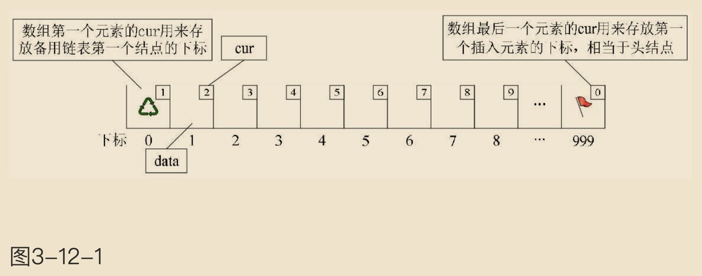

此时的图示相当于初始化的数组状态，见下面代码：

```c
// 将一维数组space中各分量链成一备用链表，space[0].cur为头指针，"0"表示空指针

Status InitList(StaticLinkList space) {
    for (int i = 0; i < MAXSIZE - 1; i++) {
        space[i].cur = i + 1;
    }
    // 目前静态链表为空，最后一个元素的cur为0
    space[MAXSIZE - 1].cur = 0;
    return OK;
}
```